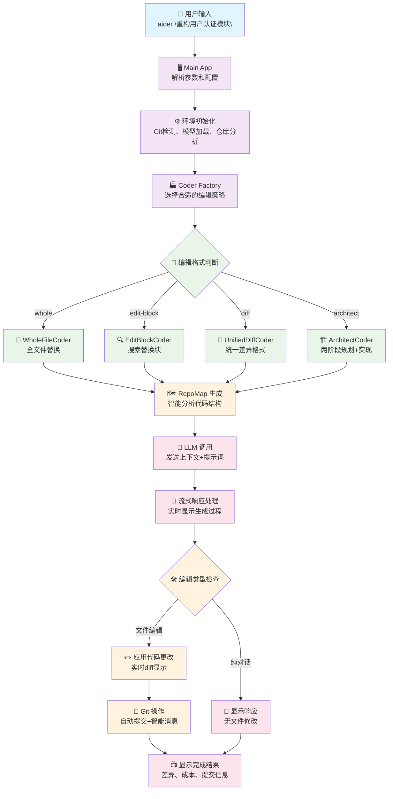
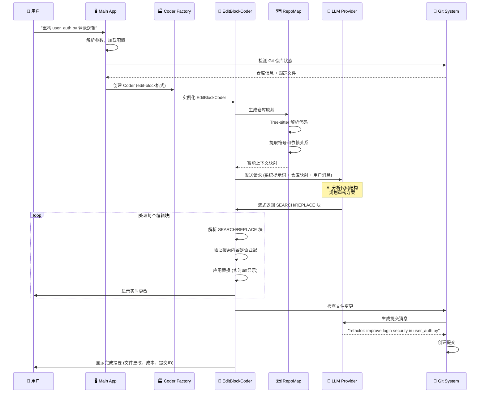

# Aider AI 架构深度分析

## 目录 (Table of Contents)

1. [架构概览 (Architecture Overview)](#架构概览-architecture-overview)
2. [工作流程 (Workflow)](#工作流程-workflow)
3. [核心模块深度分析 (Core Module Analysis)](#核心模块深度分析-core-module-analysis)
   - 3.1 [Coder 系统架构](#31-coder-系统架构)
   - 3.2 [仓库映射系统 (RepoMap)](#32-仓库映射系统-repomap)
   - 3.3 [模型管理系统](#33-模型管理系统)
   - 3.4 [Git 集成系统](#34-git-集成系统)
   - 3.5 [配置管理系统](#35-配置管理系统)
4. [编辑格式系统 (Edit Format System)](#编辑格式系统-edit-format-system)
   - 4.1 [不同 Coder 类型](#41-不同-coder-类型)
   - 4.2 [编辑策略对比](#42-编辑策略对比)
   - 4.3 [格式自动选择](#43-格式自动选择)
   - 4.4 [Architect 模式](#44-architect-模式)
5. [智能仓库分析 (Repository Intelligence)](#智能仓库分析-repository-intelligence)
   - 5.1 [Tree-sitter 集成](#51-tree-sitter-集成)
   - 5.2 [符号提取和排序](#52-符号提取和排序)
   - 5.3 [上下文窗口管理](#53-上下文窗口管理)
   - 5.4 [缓存优化](#54-缓存优化)
6. [系统提示词管理 (System Prompt Management)](#系统提示词管理-system-prompt-management)
   - 6.1 [分层提示词架构](#61-分层提示词架构)
   - 6.2 [Coder 特定提示词](#62-coder-特定提示词)
   - 6.3 [语言感知提示](#63-语言感知提示)
   - 6.4 [示例驱动设计](#64-示例驱动设计)
7. [总结与思考 (Summary & Insights)](#总结与思考-summary--insights)

---

## 架构概览 (Architecture Overview)

### 整体架构设计

Aider 采用了模块化的分层架构，以灵活的 Coder 系统为核心，支持多种 AI 编程交互模式：

```
┌─────────────────────────────────────────────────────┐
│                Main Application                     │
│          (初始化 & 参数解析 & 交互循环)               │
├─────────────────────────────────────────────────────┤
│                 Coder Factory                       │
│           (动态创建不同类型的编码器)                  │
├─────────────────────────────────────────────────────┤
│    Specialized Coders (编辑策略实现)                 │
│  EditBlock│Whole File│UnifiedDiff│Architect│Ask     │
├─────────────────────────────────────────────────────┤
│           Infrastructure Layer                      │
│   RepoMap│Models│Git│Prompts│Analytics│Config       │
└─────────────────────────────────────────────────────┘
```

### 核心架构组件

1. **Coder 系统 (`aider/coders/`)** - 核心编辑引擎
   - BaseCoder 抽象基类定义通用接口
   - 多种专门化编辑策略实现
   - 工厂模式动态创建适合的 Coder
   - 流式响应和实时差异显示

2. **仓库智能系统 (`aider/repomap.py`)** - 代码理解
   - Tree-sitter 驱动的代码解析
   - 智能符号提取和排序
   - 自适应上下文窗口管理
   - 高效缓存机制

3. **模型抽象层 (`aider/models.py`)** - LLM 集成
   - 多提供商支持 (OpenAI, Anthropic, 等)
   - 模型元数据和能力管理
   - 成本跟踪和 token 计数
   - 别名系统和动态配置

4. **Git 集成 (`aider/repo.py`)** - 版本控制
   - 智能提交消息生成
   - 归属管理 (人类 vs AI 贡献)
   - 自动 .gitignore 处理
   - Pre-commit 钩子集成

### 技术栈

- **语言**: Python 3.10+
- **AI 集成**: LiteLLM (多提供商抽象)
- **代码解析**: Tree-sitter
- **版本控制**: GitPython
- **配置管理**: ConfigArgParse
- **缓存**: diskcache + SQLite
- **UI**: Rich (终端美化)

### 关键设计特点

1. **多策略编辑**: 支持 5+ 种不同的代码编辑策略
2. **智能上下文**: 自动生成和管理仓库映射
3. **实时反馈**: 流式响应和 Live diff 显示
4. **Git 原生**: 深度集成版本控制工作流
5. **模型无关**: 抽象层支持多种 LLM 提供商
6. **配置灵活**: 多种配置方式和优先级

---

## 工作流程 (Workflow)

### 用户交互流程



### 详细执行序列

**用户输入**: "重构 user_auth.py 中的登录逻辑，使其更安全"



### 系统内部处理流程

1. **启动和初始化**:
   - 命令行参数解析和配置文件加载
   - 环境变量处理和 API 密钥设置
   - Git 仓库检测和设置
   - 模型验证和能力检查

2. **Coder 创建和配置**:
   - 根据模型和用户偏好选择编辑格式
   - 工厂模式实例化对应的 Coder
   - 加载文件列表和只读文件
   - 初始化 RepoMap 和缓存

3. **上下文构建**:
   - Tree-sitter 解析代码结构
   - 生成智能仓库映射
   - 根据上下文窗口调整映射大小
   - 整合用户消息和系统提示词

4. **AI 交互和编辑**:
   - 流式发送请求到 LLM
   - 实时解析和应用编辑块
   - Live diff 显示和验证
   - 错误处理和重试机制

5. **版本控制集成**:
   - 自动生成提交消息
   - 归属标记 (Co-authored-by)
   - Pre-commit 钩子执行
   - 更新 .gitignore 文件

---

## 核心模块深度分析 (Core Module Analysis)

### 3.1 Coder 系统架构

#### BaseCoder 抽象基类

**核心文件**: `aider/coders/base_coder.py`

```python
class Coder:
    """AI-powered code editing assistant"""
    
    def __init__(self, main_model, edit_format, io, repo, **kwargs):
        self.main_model = main_model
        self.edit_format = edit_format
        self.io = io
        self.repo = repo
        self.cur_messages = []  # 对话历史
        self.done_messages = []  # 已完成的消息
        self.fnames = set()  # 正在编辑的文件
        self.abs_fnames = set()  # 绝对路径文件名
        
    @classmethod
    def create(cls, main_model, edit_format=None, **kwargs):
        """工厂方法：根据编辑格式创建对应的Coder"""
        if not edit_format:
            edit_format = main_model.edit_format
            
        # 动态选择Coder类型
        if edit_format == "whole":
            from .wholefile_coder import WholeFileCoder
            return WholeFileCoder(main_model, edit_format, **kwargs)
        elif edit_format == "edit-block":
            from .editblock_coder import EditBlockCoder
            return EditBlockCoder(main_model, edit_format, **kwargs)
        elif edit_format == "diff":
            from .udiff_coder import UnifiedDiffCoder
            return UnifiedDiffCoder(main_model, edit_format, **kwargs)
        elif edit_format == "architect":
            from .architect_coder import ArchitectCoder
            return ArchitectCoder(main_model, edit_format, **kwargs)
    
    def run(self, with_message=None):
        """主要交互循环"""
        while True:
            if with_message:
                inp = with_message
                with_message = None
            else:
                inp = self.io.get_input()
                
            if not inp:
                continue
                
            self.cur_messages.append(dict(role="user", content=inp))
            
            # 发送到LLM并处理响应
            content = self.send_and_receive()
            
            if content:
                # 解析和应用编辑
                self.apply_updates(content)
                
    def send_and_receive(self):
        """发送消息到LLM并接收响应"""
        messages = self.format_messages()
        
        # 流式或非流式处理
        if self.stream:
            content = self.send_stream(messages)
        else:
            content = self.send_nonstream(messages)
            
        return content
        
    def apply_updates(self, content):
        """应用AI生成的编辑 - 子类实现"""
        raise NotImplementedError
```

#### 工厂模式和多态设计

```python
# 每种Coder都有其特定的编辑策略
class EditBlockCoder(Coder):
    """使用SEARCH/REPLACE块进行编辑"""
    
    def apply_updates(self, content):
        # 解析SEARCH/REPLACE块
        edits = self.find_original_update_blocks(content)
        
        for path, original, updated in edits:
            # 精确匹配和替换
            if self.do_replace(path, original, updated):
                self.io.tool_output(f"Applied edit to {path}")

class WholeFileCoder(Coder):
    """全文件替换编辑"""
    
    def apply_updates(self, content):
        # 解析文件块
        files = self.parse_file_blocks(content)
        
        for path, new_content in files.items():
            # 替换整个文件
            self.write_text(path, new_content)
            self.io.tool_output(f"Rewrote {path}")
```

### 3.2 仓库映射系统 (RepoMap)

#### 智能代码分析引擎

**核心文件**: `aider/repomap.py`

```python
class RepoMap:
    """智能仓库映射和上下文生成"""
    
    def __init__(self, map_tokens=1024, root=None, main_model=None):
        self.map_tokens = map_tokens
        self.root = Path(root or os.getcwd())
        self.main_model = main_model
        
        # Tree-sitter解析器缓存
        self.PARSERS = {}
        
        # 符号排序权重
        self.token_count = defaultdict(float)
        
    def get_repo_map(self, chat_files, other_files):
        """生成智能仓库映射"""
        
        # 1. 解析所有文件，提取符号
        tags_cache = {}
        for fname in chat_files + other_files:
            if self.should_analyze_file(fname):
                tags_cache[fname] = self.get_tags(fname)
        
        # 2. 计算符号重要性分数
        ranked_tags = self.rank_tags(tags_cache, chat_files)
        
        # 3. 根据token限制生成映射
        repo_map = self.to_tree(ranked_tags, chat_files, other_files)
        
        return repo_map
        
    def get_tags(self, fname):
        """使用Tree-sitter提取代码符号"""
        lang = self.get_language(fname)
        if not lang:
            return []
            
        parser = self.get_parser(lang)
        if not parser:
            return []
            
        try:
            with open(fname, 'r', encoding='utf-8') as f:
                code = f.read()
        except (OSError, UnicodeDecodeError):
            return []
            
        tree = parser.parse(bytes(code, 'utf8'))
        
        # 执行符号提取查询
        query_path = f"queries/tree-sitter-languages/{lang}-tags.scm"
        if os.path.exists(query_path):
            with open(query_path) as f:
                query_scm = f.read()
                
            query = lang.query(query_scm)
            captures = query.captures(tree.root_node)
            
            # 提取符号信息
            tags = []
            for node, tag in captures:
                if tag == "name":
                    tags.append({
                        'name': code[node.start_byte:node.end_byte],
                        'line': node.start_point[0] + 1,
                        'kind': self.get_symbol_kind(node),
                    })
                    
            return tags
```

#### 智能符号排序

```python
def rank_tags(self, tags_cache, chat_files):
    """基于多个因素对符号进行智能排序"""
    
    ranked_tags = []
    
    for fname, tags in tags_cache.items():
        for tag in tags:
            # 基础得分
            score = 1.0
            
            # 1. 聊天文件中的符号权重更高
            if fname in chat_files:
                score *= 10.0
                
            # 2. 最近提到的符号权重更高
            if tag['name'] in self.recent_mentions:
                score *= 5.0
                
            # 3. 依赖关系权重
            if self.has_dependencies(tag, chat_files):
                score *= 3.0
                
            # 4. 符号类型权重（类 > 函数 > 变量）
            type_weights = {
                'class': 3.0,
                'function': 2.0,
                'method': 2.0,
                'variable': 1.0
            }
            score *= type_weights.get(tag.get('kind', 'variable'), 1.0)
            
            ranked_tags.append((score, fname, tag))
    
    # 按得分排序
    ranked_tags.sort(key=lambda x: x[0], reverse=True)
    
    return ranked_tags
```

### 3.3 模型管理系统

#### 多提供商抽象层

**核心文件**: `aider/models.py`

```python
class Model:
    """LLM模型的统一抽象"""
    
    def __init__(self, model, weak_model=None, editor_model=None):
        self.name = model
        self.weak_model = weak_model
        self.editor_model = editor_model
        
        # 从模型元数据加载信息
        self.info = self.get_model_info(model)
        
        # 设置模型能力
        self.max_context_tokens = self.info.get('max_input_tokens', 4096)
        self.has_vision = self.info.get('supports_vision', False)
        self.edit_format = self.info.get('edit_format', 'whole')
        self.streaming = self.info.get('supports_streaming', True)
        
    def send_messages(self, messages, functions=None):
        """发送消息到LLM"""
        
        # 使用litellm进行统一调用
        import litellm
        
        kwargs = {
            'model': self.name,
            'messages': messages,
            'stream': self.streaming,
        }
        
        if functions:
            kwargs['functions'] = functions
            
        if self.streaming:
            return litellm.completion(**kwargs)
        else:
            response = litellm.completion(**kwargs)
            return response.choices[0].message.content
            
    def token_count(self, text):
        """计算文本的token数量"""
        try:
            import tiktoken
            
            # 尝试获取模型特定的编码器
            encoding = tiktoken.encoding_for_model(self.name)
            return len(encoding.encode(text))
        except:
            # fallback到近似计算
            return len(text) // 4

# 模型注册和别名系统
MODEL_ALIASES = {
    'sonnet': 'claude-3-5-sonnet-20241022',
    'haiku': 'claude-3-haiku-20240307',
    'gpt-4': 'gpt-4-0125-preview',
    'gpt-3.5': 'gpt-3.5-turbo',
    'deepseek': 'deepseek/deepseek-chat',
}

def register_models(model_settings_files):
    """从配置文件注册模型设置"""
    
    for settings_file in model_settings_files:
        if os.path.exists(settings_file):
            with open(settings_file) as f:
                settings = yaml.safe_load(f)
                
            for model_name, model_config in settings.items():
                # 注册模型配置
                register_model(model_name, model_config)
```

### 3.4 Git 集成系统

#### 智能版本控制

**核心文件**: `aider/repo.py`

```python
class GitRepo:
    """Git仓库操作的高级接口"""
    
    def __init__(self, io, fnames, git_dname, **kwargs):
        self.io = io
        self.root = git_dname or self.find_git_root()
        
        # 初始化git仓库对象
        if git:
            self.repo = git.Repo(self.root)
        else:
            self.repo = None
            
        # 提交归属设置
        self.attribute_author = kwargs.get('attribute_author', True)
        self.attribute_committer = kwargs.get('attribute_committer', True)
        
        # AI模型用于生成提交消息
        self.commit_message_models = kwargs.get('models', [])
        
    def commit(self, fnames=None, context=None, message=None):
        """智能提交更改"""
        
        if not fnames:
            fnames = self.get_dirty_files()
            
        if not fnames:
            self.io.tool_output("No changes to commit")
            return
            
        # 1. 生成提交消息
        if not message:
            message = self.generate_commit_message(fnames, context)
            
        # 2. 设置归属信息
        commit_kwargs = {}
        if self.attribute_author:
            commit_kwargs['author'] = self.get_aider_actor()
        if self.attribute_committer:
            commit_kwargs['committer'] = self.get_aider_actor()
            
        # 3. 添加Co-authored-by标签
        if self.attribute_co_authored_by:
            message += f"\n\nCo-authored-by: aider <aider@paul.gauthier.com>"
            
        # 4. 执行提交
        try:
            self.repo.git.add(fnames)
            commit = self.repo.index.commit(message, **commit_kwargs)
            
            self.io.tool_output(f"Commit {commit.hexsha[:7]}: {message}")
            return commit
            
        except git.exc.GitCommandError as e:
            self.io.tool_error(f"Git commit failed: {e}")
            return None
            
    def generate_commit_message(self, fnames, context):
        """使用AI生成智能提交消息"""
        
        # 获取文件差异
        diffs = []
        for fname in fnames:
            try:
                diff = self.repo.git.diff('HEAD', fname)
                if diff:
                    diffs.append(f"--- {fname}\n{diff}")
            except:
                pass
                
        if not diffs:
            return "Update files"
            
        # 构建提示词
        diff_text = "\n".join(diffs)
        
        prompt = f"""
Based on the following git diff, write a concise commit message that follows conventional commit format:

{diff_text}

The commit message should:
- Start with a type (feat, fix, docs, style, refactor, test, chore)
- Be under 80 characters
- Describe what was changed, not how
- Use imperative mood

Commit message:"""

        # 发送到弱模型生成
        if self.commit_message_models:
            model = self.commit_message_models[0]  # 使用弱模型
            try:
                response = model.send_messages([
                    {"role": "user", "content": prompt}
                ])
                
                # 清理响应
                message = response.strip().strip('"').strip("'")
                if len(message) > 80:
                    message = message[:77] + "..."
                    
                return message
            except:
                pass
                
        # Fallback到简单消息
        return f"Update {', '.join(os.path.basename(f) for f in fnames)}"
```

### 3.5 配置管理系统

#### 多层次配置系统

**核心文件**: `aider/args.py`

```python
def get_parser(config_files=None, git_root=None):
    """创建配置解析器"""
    
    # 使用ConfigArgParse支持多种配置源
    parser = configargparse.ArgumentParser(
        default_config_files=config_files or [],
        auto_env_var_prefix='AIDER_',  # 自动环境变量前缀
        formatter_class=ArgsFormatter,
    )
    
    # 模型和API配置
    parser.add_argument(
        '--model',
        default='gpt-4o-mini',
        help='Model to use for main chat (default: gpt-4o-mini)'
    )
    
    parser.add_argument(
        '--edit-format',
        choices=['whole', 'edit-block', 'diff', 'architect'],
        help='Edit format to use'
    )
    
    # 配置文件
    parser.add_argument(
        '--config',
        is_config_file=True,
        help='config file path'
    )
    
    # Git集成
    parser.add_argument(
        '--git/--no-git',
        action=configargparse.BooleanOptionalAction,
        default=True,
        help='Enable/disable git integration (default: enabled)'
    )
    
    # 自动提交
    parser.add_argument(
        '--auto-commits/--no-auto-commits', 
        action=configargparse.BooleanOptionalAction,
        default=True,
        help='Enable/disable auto commits (default: enabled)'
    )
    
    return parser

# 配置文件搜索路径
def generate_search_path_list(default_file, git_root, command_line_file):
    """生成配置文件搜索路径"""
    files = []
    
    # 1. 用户主目录
    files.append(Path.home() / default_file)
    
    # 2. Git仓库根目录
    if git_root:
        files.append(Path(git_root) / default_file)
        
    # 3. 当前工作目录
    files.append(default_file)
    
    # 4. 命令行指定文件
    if command_line_file:
        files.append(command_line_file)
        
    return files

# 示例配置文件 (.aider.conf.yml)
"""
# AI模型设置
model: claude-3-5-sonnet-20241022
weak-model: claude-3-haiku-20240307

# 编辑格式
edit-format: edit-block

# Git设置
auto-commits: true
attribute-author: true
attribute-committer: true

# API密钥 (更推荐使用环境变量)
# openai-api-key: sk-...
# anthropic-api-key: sk-ant-...

# 其他设置
stream: true
pretty: true
show-diffs: true
"""
```

---

## 编辑格式系统 (Edit Format System)

### 4.1 不同 Coder 类型

Aider 支持多种编辑策略，每种都有其特定的优势和适用场景：

#### EditBlockCoder - 搜索替换块

**文件**: `aider/coders/editblock_coder.py`

```python
class EditBlockCoder(Coder):
    """使用SEARCH/REPLACE块进行精确编辑"""
    
    edit_format = "edit-block"
    
    def find_original_update_blocks(self, content):
        """解析AI响应中的SEARCH/REPLACE块"""
        
        # 匹配模式
        pattern = re.compile(
            r'^\s*```\s*(\w+)?\s*\n(.*?)\n\s*```\s*\n\s*SEARCH\s*\n(.*?)\n\s*REPLACE\s*\n(.*?)\n\s*```',
            re.MULTILINE | re.DOTALL
        )
        
        edits = []
        for match in pattern.finditer(content):
            filename = match.group(1) or self.get_current_file()
            search_text = match.group(3).strip()
            replace_text = match.group(4).strip()
            
            edits.append((filename, search_text, replace_text))
            
        return edits
        
    def do_replace(self, fname, search, replace):
        """执行精确的搜索替换"""
        
        try:
            with open(fname, 'r') as f:
                content = f.read()
        except OSError:
            self.io.tool_error(f"Could not read {fname}")
            return False
            
        # 精确匹配
        if search not in content:
            self.io.tool_error(f"Search text not found in {fname}")
            self.show_search_replace_mismatch(content, search)
            return False
            
        # 检查是否有多个匹配
        count = content.count(search)
        if count > 1:
            self.io.tool_error(f"Search text appears {count} times in {fname}")
            return False
            
        # 执行替换
        new_content = content.replace(search, replace, 1)
        
        try:
            with open(fname, 'w') as f:
                f.write(new_content)
                
            # 显示差异
            self.show_diff(fname, content, new_content)
            return True
            
        except OSError:
            self.io.tool_error(f"Could not write {fname}")
            return False
```

#### WholeFileCoder - 全文件替换

**文件**: `aider/coders/wholefile_coder.py`

```python
class WholeFileCoder(Coder):
    """全文件内容替换策略"""
    
    edit_format = "whole"
    
    def find_original_update_blocks(self, content):
        """解析完整文件块"""
        
        # 匹配文件块模式: ```filename\n内容\n```
        pattern = re.compile(
            r'```(\S+)\n(.*?)\n```',
            re.MULTILINE | re.DOTALL
        )
        
        file_blocks = {}
        for match in pattern.finditer(content):
            filename = match.group(1)
            file_content = match.group(2)
            
            # 验证文件名
            if self.is_valid_filename(filename):
                file_blocks[filename] = file_content
                
        return file_blocks
        
    def apply_updates(self, content):
        """应用文件更新"""
        
        file_blocks = self.find_original_update_blocks(content)
        
        for filename, new_content in file_blocks.items():
            try:
                # 读取原内容用于显示差异
                old_content = ""
                if os.path.exists(filename):
                    with open(filename, 'r') as f:
                        old_content = f.read()
                        
                # 写入新内容
                with open(filename, 'w') as f:
                    f.write(new_content)
                    
                # 显示差异
                if old_content:
                    self.show_diff(filename, old_content, new_content)
                else:
                    self.io.tool_output(f"Created {filename}")
                    
                # 添加到Git跟踪
                if self.repo:
                    self.repo.add_file(filename)
                    
            except OSError as e:
                self.io.tool_error(f"Failed to write {filename}: {e}")
```

#### ArchitectCoder - 两阶段设计

**文件**: `aider/coders/architect_coder.py`

```python
class ArchitectCoder(Coder):
    """两阶段架构师模式：规划 + 实现"""
    
    edit_format = "architect"
    
    def __init__(self, main_model, **kwargs):
        super().__init__(main_model, **kwargs)
        
        # 架构师用强模型，实现用主模型
        self.architect_model = main_model
        self.implementation_model = kwargs.get('editor_model', main_model)
        
    def run(self, with_message=None):
        """两阶段执行流程"""
        
        if with_message:
            inp = with_message
        else:
            inp = self.io.get_input()
            
        # 阶段1: 架构师规划
        plan = self.architect_phase(inp)
        
        if not plan:
            return
            
        # 显示规划结果
        self.io.tool_output("=== ARCHITECT PLAN ===")
        self.io.tool_output(plan)
        self.io.tool_output("=== IMPLEMENTING ===")
        
        # 阶段2: 实现者执行
        self.implementation_phase(plan, inp)
        
    def architect_phase(self, user_request):
        """架构师阶段：生成实现计划"""
        
        architect_prompt = f"""
You are a software architect. Analyze this request and create a detailed implementation plan:

{user_request}

Your plan should:
1. Break down the task into specific, actionable steps
2. Identify which files need to be modified
3. Describe the changes needed for each file
4. Consider dependencies and order of implementation
5. Highlight any potential risks or considerations

Provide a clear, structured plan that another AI can follow to implement the changes.
"""

        messages = [{"role": "user", "content": architect_prompt}]
        
        # 添加仓库映射作为上下文
        repo_map = self.get_repo_map()
        if repo_map:
            messages.insert(0, {
                "role": "system", 
                "content": f"Repository structure:\n{repo_map}"
            })
            
        # 发送给架构师模型
        plan = self.architect_model.send_messages(messages)
        
        return plan
        
    def implementation_phase(self, plan, original_request):
        """实现阶段：执行具体更改"""
        
        implementation_prompt = f"""
Original request: {original_request}

Implementation plan: {plan}

Now implement the changes described in the plan. Use appropriate edit blocks to make the necessary modifications to the codebase.
"""

        # 切换到实现模型
        self.cur_messages.append({
            "role": "user", 
            "content": implementation_prompt
        })
        
        # 使用EditBlockCoder进行实际实现
        implementation_coder = EditBlockCoder(
            self.implementation_model,
            edit_format="edit-block",
            io=self.io,
            repo=self.repo,
            fnames=self.fnames,
            **self.kwargs
        )
        
        # 执行实现
        content = implementation_coder.send_and_receive()
        if content:
            implementation_coder.apply_updates(content)
```

### 4.2 编辑策略对比

| 编辑格式 | 优势 | 劣势 | 适用场景 |
|---------|------|------|----------|
| **edit-block** | 精确控制，最小变更，易于审查 | 需要精确匹配，可能因空格失败 | 局部修改，现有代码重构 |
| **whole** | 简单可靠，不会部分失败 | 大量变更，难以追踪具体修改 | 新文件创建，大幅重构 |
| **diff** | 标准格式，工具支持好 | 复杂，上下文敏感 | 精确的行级修改 |
| **architect** | 复杂任务规划，两阶段验证 | slower，资源消耗大 | 大型功能开发，架构变更 |

### 4.3 格式自动选择

```python
def select_edit_format(model, task_type, file_size, complexity):
    """基于多个因素自动选择编辑格式"""
    
    # 1. 模型默认偏好
    default_format = model.edit_format
    
    # 2. 任务类型考虑
    if task_type == "new_file":
        return "whole"
    elif task_type == "small_fix":
        return "edit-block"
    elif task_type == "architecture":
        return "architect"
        
    # 3. 文件大小考虑
    if file_size > 1000:  # 大文件
        if complexity == "high":
            return "architect"
        else:
            return "edit-block"
    else:  # 小文件
        return "whole"
        
    # 4. 模型能力考虑
    if model.supports_long_context and complexity == "high":
        return "architect"
        
    return default_format

# 动态格式切换
class AdaptiveCoder(Coder):
    """自适应编辑格式选择"""
    
    def apply_updates(self, content):
        """根据内容动态选择处理方式"""
        
        # 检测内容类型
        if self.has_search_replace_blocks(content):
            # 切换到EditBlock模式
            edit_coder = EditBlockCoder(self.main_model, **self.kwargs)
            return edit_coder.apply_updates(content)
            
        elif self.has_file_blocks(content):
            # 切换到WholeFile模式  
            whole_coder = WholeFileCoder(self.main_model, **self.kwargs)
            return whole_coder.apply_updates(content)
            
        elif self.has_diff_blocks(content):
            # 切换到Diff模式
            diff_coder = UnifiedDiffCoder(self.main_model, **self.kwargs)
            return diff_coder.apply_updates(content)
            
        else:
            # 默认处理
            return super().apply_updates(content)
```

### 4.4 Architect 模式

Architect 模式是 Aider 的创新功能，将复杂任务分解为规划和实现两个阶段：

```python
# 实际的Architect工作流示例
"""
用户输入: "Add user authentication system with JWT tokens"

=== ARCHITECT PHASE ===
架构师分析:
1. 需要创建的文件:
   - auth/models.py (用户模型)
   - auth/routes.py (认证路由)
   - auth/utils.py (JWT工具函数)
   - auth/middleware.py (认证中间件)

2. 修改的文件:
   - app.py (注册路由)
   - requirements.txt (添加JWT依赖)
   - config.py (添加SECRET_KEY)

3. 实现步骤:
   a) 首先创建用户模型和数据库迁移
   b) 实现JWT工具函数
   c) 创建认证路由 (login, register, refresh)
   d) 添加认证中间件
   e) 集成到主应用

4. 考虑事项:
   - 密码哈希安全性
   - JWT过期时间配置
   - 刷新token机制
   - 错误处理

=== IMPLEMENTATION PHASE ===
实现者基于规划执行具体代码修改...
"""
```

这种两阶段方法特别适合：
- 复杂的功能开发
- 涉及多文件的架构性变更
- 需要careful planning的重构任务
- 大型代码库的系统性修改

---

## 智能仓库分析 (Repository Intelligence)

### 5.1 Tree-sitter 集成

Aider 使用 Tree-sitter 进行深度代码分析，支持 100+ 种编程语言：

#### 语言检测和解析器管理

```python
class RepoMap:
    """智能仓库映射生成器"""
    
    # 支持的语言映射
    LANGUAGE_MAPPING = {
        '.py': 'python',
        '.js': 'javascript', 
        '.ts': 'typescript',
        '.tsx': 'tsx',
        '.java': 'java',
        '.cpp': 'cpp',
        '.rs': 'rust',
        '.go': 'go',
        # ... 100+ 语言
    }
    
    def get_language(self, fname):
        """基于文件扩展名检测语言"""
        ext = Path(fname).suffix.lower()
        return self.LANGUAGE_MAPPING.get(ext)
        
    def get_parser(self, lang):
        """获取或创建Tree-sitter解析器"""
        if lang not in self.PARSERS:
            try:
                # 动态导入语言模块
                language = getattr(tree_sitter_languages, lang)
                parser = tree_sitter.Parser()
                parser.set_language(language.language)
                self.PARSERS[lang] = parser
            except (AttributeError, ImportError):
                return None
                
        return self.PARSERS[lang]
```

#### 符号提取查询

Aider 为每种语言定义了专门的 Tree-sitter 查询来提取关键符号：

**Python 符号提取** (`queries/tree-sitter-languages/python-tags.scm`):
```scheme
; 类定义
(class_definition
  name: (identifier) @name.definition.class) @definition.class

; 函数定义
(function_definition
  name: (identifier) @name.definition.function) @definition.function

; 方法定义
(class_definition
  body: (block
    (function_definition
      name: (identifier) @name.definition.method))) @definition.method

; 导入语句
(import_statement
  name: (dotted_name) @name.reference.import) @reference.import

; 变量赋值
(assignment
  left: (identifier) @name.definition.variable) @definition.variable
```

**JavaScript 符号提取** (`queries/tree-sitter-languages/javascript-tags.scm`):
```scheme
; 函数声明
(function_declaration
  name: (identifier) @name.definition.function) @definition.function

; 类声明
(class_declaration
  name: (identifier) @name.definition.class) @definition.class

; 方法定义
(class_declaration
  body: (class_body
    (method_definition
      name: (property_name) @name.definition.method))) @definition.method

; 变量声明
(variable_declarator
  name: (identifier) @name.definition.variable) @definition.variable

; 导入声明
(import_statement
  source: (string) @name.reference.import) @reference.import
```

### 5.2 符号提取和排序

#### 多维度符号重要性评分

```python
def rank_tags(self, tags_cache, chat_files, other_files):
    """基于多个维度计算符号重要性"""
    
    # 1. 收集所有符号引用
    all_symbols = defaultdict(list)
    symbol_files = defaultdict(set)
    
    for fname, tags in tags_cache.items():
        for tag in tags:
            symbol_name = tag['name']
            all_symbols[symbol_name].append((fname, tag))
            symbol_files[symbol_name].add(fname)
            
    # 2. 计算符号得分
    ranked_tags = []
    
    for symbol_name, instances in all_symbols.items():
        for fname, tag in instances:
            score = self.calculate_symbol_score(
                symbol_name, tag, fname, 
                symbol_files[symbol_name],
                chat_files, other_files
            )
            
            ranked_tags.append({
                'score': score,
                'symbol': symbol_name,
                'file': fname,
                'tag': tag,
                'line': tag.get('line', 0),
                'kind': tag.get('kind', 'unknown')
            })
            
    # 3. 按得分排序
    ranked_tags.sort(key=lambda x: x['score'], reverse=True)
    
    return ranked_tags
    
def calculate_symbol_score(self, symbol, tag, fname, symbol_files, chat_files, other_files):
    """计算单个符号的重要性得分"""
    
    score = 1.0
    
    # 基于文件类型的权重
    if fname in chat_files:
        score *= 10.0  # 聊天中的文件权重高
    elif fname in other_files:
        score *= 3.0   # 其他跟踪文件中等权重
    else:
        score *= 1.0   # 非跟踪文件低权重
        
    # 基于符号类型的权重
    type_weights = {
        'class': 5.0,
        'function': 3.0,
        'method': 3.0,
        'variable': 1.0,
        'import': 2.0,
        'constant': 2.0
    }
    score *= type_weights.get(tag.get('kind', 'variable'), 1.0)
    
    # 基于使用频率的权重
    usage_count = len(symbol_files)
    if usage_count > 1:
        score *= min(usage_count, 5)  # 最多5倍加权
        
    # 基于最近提及的权重
    if symbol in self.recent_mentions:
        recency = self.recent_mentions[symbol]
        score *= (2.0 ** recency)  # 越近期提及权重越高
        
    # 基于依赖关系的权重
    if self.has_dependencies(symbol, chat_files):
        score *= 2.0
        
    # 基于符号长度的权重（更具描述性的符号权重更高）
    if len(symbol) > 3:
        score *= 1.5
        
    return score
```

### 5.3 上下文窗口管理

#### 自适应映射大小

```python
def to_tree(self, ranked_tags, chat_files, other_files):
    """生成适应上下文窗口的树形映射"""
    
    output = []
    current_tokens = 0
    
    # 按文件分组符号
    files_tags = defaultdict(list)
    for tag_info in ranked_tags:
        files_tags[tag_info['file']].append(tag_info)
        
    # 优先处理聊天文件
    for fname in chat_files:
        if fname in files_tags:
            file_content = self.format_file_symbols(fname, files_tags[fname])
            file_tokens = self.estimate_tokens(file_content)
            
            if current_tokens + file_tokens <= self.map_tokens:
                output.append(file_content)
                current_tokens += file_tokens
            else:
                # 尝试截断显示最重要的符号
                truncated = self.truncate_file_symbols(
                    fname, files_tags[fname], 
                    self.map_tokens - current_tokens
                )
                if truncated:
                    output.append(truncated)
                break
                
    # 处理其他文件
    for fname in other_files:
        if fname in files_tags and current_tokens < self.map_tokens:
            remaining_tokens = self.map_tokens - current_tokens
            file_content = self.format_file_symbols(
                fname, files_tags[fname], 
                max_tokens=remaining_tokens
            )
            
            if file_content:
                output.append(file_content)
                current_tokens += self.estimate_tokens(file_content)
                
    return "\n".join(output)
    
def format_file_symbols(self, fname, tag_infos, max_tokens=None):
    """格式化文件的符号信息"""
    
    output = [f"## {fname}"]
    current_tokens = self.estimate_tokens(output[0])
    
    # 按符号类型分组
    classes = [t for t in tag_infos if t['kind'] == 'class']
    functions = [t for t in tag_infos if t['kind'] == 'function']
    methods = [t for t in tag_infos if t['kind'] == 'method']
    
    # 优先显示类
    for tag_info in classes:
        line = f"class {tag_info['symbol']}:"
        line_tokens = self.estimate_tokens(line)
        
        if max_tokens and current_tokens + line_tokens > max_tokens:
            break
            
        output.append(f"  {line}")
        current_tokens += line_tokens
        
        # 显示类的方法
        class_methods = [t for t in methods 
                        if self.is_method_of_class(t, tag_info['symbol'])]
        for method in class_methods[:3]:  # 最多显示3个方法
            method_line = f"    def {method['symbol']}():"
            method_tokens = self.estimate_tokens(method_line)
            
            if max_tokens and current_tokens + method_tokens > max_tokens:
                break
                
            output.append(method_line)
            current_tokens += method_tokens
            
    # 显示独立函数
    for tag_info in functions:
        line = f"def {tag_info['symbol']}():"
        line_tokens = self.estimate_tokens(line)
        
        if max_tokens and current_tokens + line_tokens > max_tokens:
            break
            
        output.append(f"  {line}")
        current_tokens += line_tokens
        
    return "\n".join(output)
```

### 5.4 缓存优化

#### 多层缓存策略

```python
class RepoMap:
    """带有智能缓存的仓库映射"""
    
    def __init__(self, **kwargs):
        # 文件解析结果缓存
        self.cache_dir = Path.home() / ".aider" / "cache"
        self.cache_dir.mkdir(parents=True, exist_ok=True)
        
        # 使用diskcache进行持久化缓存
        import diskcache
        self.tags_cache = diskcache.Cache(
            self.cache_dir / "tags",
            size_limit=100_000_000  # 100MB
        )
        
        # 内存缓存用于当前会话
        self.memory_cache = {}
        
    def get_tags(self, fname):
        """获取文件的符号标签，使用多层缓存"""
        
        # 1. 检查内存缓存
        if fname in self.memory_cache:
            return self.memory_cache[fname]
            
        # 2. 检查文件修改时间
        try:
            mtime = os.path.getmtime(fname)
            cache_key = f"{fname}:{mtime}"
            
            # 3. 检查磁盘缓存
            if cache_key in self.tags_cache:
                tags = self.tags_cache[cache_key]
                self.memory_cache[fname] = tags
                return tags
                
        except OSError:
            return []
            
        # 4. 重新解析文件
        tags = self.parse_file_tags(fname)
        
        # 5. 更新缓存
        try:
            self.tags_cache[cache_key] = tags
            self.memory_cache[fname] = tags
        except:
            pass  # 缓存失败不影响功能
            
        return tags
        
    def parse_file_tags(self, fname):
        """实际解析文件提取符号"""
        
        lang = self.get_language(fname)
        if not lang:
            return []
            
        parser = self.get_parser(lang)
        if not parser:
            return []
            
        try:
            with open(fname, 'r', encoding='utf-8', errors='ignore') as f:
                code = f.read()
        except OSError:
            return []
            
        # Tree-sitter解析
        tree = parser.parse(bytes(code, 'utf8'))
        
        # 加载查询文件
        query_file = f"queries/tree-sitter-languages/{lang}-tags.scm"
        if not os.path.exists(query_file):
            return []
            
        with open(query_file, 'r') as f:
            query_scm = f.read()
            
        # 执行查询
        query = lang.query(query_scm)
        captures = query.captures(tree.root_node)
        
        # 提取符号信息
        tags = []
        lines = code.split('\n')
        
        for node, tag_type in captures:
            if tag_type.endswith('.name'):
                symbol_name = code[node.start_byte:node.end_byte]
                line_num = node.start_point[0] + 1
                
                # 确定符号类型
                kind = self.determine_symbol_kind(tag_type, node, code)
                
                tags.append({
                    'name': symbol_name,
                    'line': line_num,
                    'kind': kind,
                    'context': lines[max(0, line_num-2):line_num+1] if line_num > 0 else []
                })
                
        return tags
        
    def determine_symbol_kind(self, tag_type, node, code):
        """确定符号的具体类型"""
        
        if 'class' in tag_type:
            return 'class'
        elif 'function' in tag_type:
            return 'function'  
        elif 'method' in tag_type:
            return 'method'
        elif 'variable' in tag_type:
            return 'variable'
        elif 'import' in tag_type:
            return 'import'
        elif 'constant' in tag_type:
            return 'constant'
        else:
            return 'unknown'
```

---

## 系统提示词管理 (System Prompt Management)

### 6.1 分层提示词架构

Aider 采用了模块化的提示词管理策略，每种 Coder 类型都有专门的提示词模板：

#### 核心提示词结构

**主提示词文件**: `aider/prompts.py`

```python
# 系统级提示词模板
def gpt_system_prompt(edit_format):
    """根据编辑格式生成系统提示词"""
    
    base_prompt = """Act as an expert software developer.
Always use best practices when coding.
Respect and use existing conventions, libraries, etc that are already present in the code base.
"""

    if edit_format == "edit-block":
        base_prompt += """
When you need to edit code, use this exact format:

```filename
SEARCH
exact code to find and replace
REPLACE
exact new code to put in its place
```

ONLY return edit blocks for files that need changes. Do not repeat unchanged code.
"""

    elif edit_format == "whole":
        base_prompt += """
When you need to edit code, provide the complete new file content:

```filename
complete new file content here
```

Only show files that you are creating or modifying.
"""

    elif edit_format == "diff":
        base_prompt += """
When you need to edit code, use unified diff format:

```diff
--- filename
+++ filename
@@ -1,3 +1,3 @@
 unchanged line
-line to remove
+line to add
 unchanged line
```
"""

    return base_prompt

# 提交消息生成提示词
def commit_message_prompt(diffs):
    """生成Git提交消息的提示词"""
    
    return f"""Write a concise git commit message for these changes:

{diffs}

Follow conventional commit format:
- type(scope): description
- Common types: feat, fix, docs, style, refactor, test, chore
- Keep under 80 characters
- Use imperative mood
- Focus on WHAT changed, not HOW

Commit message:"""

# 代码总结提示词
def summarize_prompt():
    """生成代码总结的提示词"""
    
    return """Summarize the key points of our conversation so far.
Focus on:
- What files were modified
- What changes were made
- Any important decisions or trade-offs
- Outstanding issues or next steps

Keep it concise but comprehensive."""
```

### 6.2 Coder 特定提示词

每种编辑策略都有详细的专门提示词：

#### EditBlockCoder 提示词

**文件**: `aider/coders/editblock_prompts.py`

```python
def main_system_prompt():
    """EditBlock格式的详细系统提示词"""
    
    return """You are an AI programming assistant.

When you want to modify code, use the edit-block format:

```filename
SEARCH
exact_code_to_find
REPLACE
exact_replacement_code
```

IMPORTANT RULES:
1. Include enough context in SEARCH blocks to uniquely identify the location
2. The SEARCH block must match EXACTLY what's in the file (whitespace, indentation, etc.)
3. Only show the minimal changes needed
4. If you need to edit multiple locations in a file, use multiple edit blocks
5. Don't repeat unchanged code outside of edit blocks

EXAMPLES:

Example 1 - Adding a new method to a class:
```src/calculator.py
SEARCH
class Calculator:
    def add(self, a, b):
        return a + b
REPLACE
class Calculator:
    def add(self, a, b):
        return a + b
    
    def subtract(self, a, b):
        return a - b
```

Example 2 - Fixing a bug in existing code:
```src/utils.py
SEARCH
def process_data(data):
    if data is None:
        return []
    return data.split(',')
REPLACE
def process_data(data):
    if data is None:
        return []
    return [item.strip() for item in data.split(',')]
```

Example 3 - Multiple edits in the same file:
```app.py
SEARCH
from flask import Flask
app = Flask(__name__)
REPLACE
from flask import Flask, request, jsonify
app = Flask(__name__)
```

```app.py
SEARCH
@app.route('/')
def hello():
    return 'Hello World!'
REPLACE
@app.route('/')
def hello():
    return jsonify({'message': 'Hello World!'})
```

Always ensure SEARCH blocks match exactly what's in the file!
"""

def search_replace_examples():
    """提供丰富的搜索替换示例"""
    
    return """
MORE EXAMPLES OF PROPER SEARCH/REPLACE BLOCKS:

1. Adding imports:
```main.py
SEARCH
import os
import sys
REPLACE
import os
import sys
import json
from datetime import datetime
```

2. Modifying function parameters:
```api.py
SEARCH
def create_user(name, email):
    user = User(name=name, email=email)
    return user
REPLACE
def create_user(name, email, role='user'):
    user = User(name=name, email=email, role=role)
    return user
```

3. Adding error handling:
```database.py
SEARCH
def connect_db():
    return sqlite3.connect('app.db')
REPLACE
def connect_db():
    try:
        return sqlite3.connect('app.db')
    except sqlite3.Error as e:
        print(f"Database connection failed: {e}")
        return None
```

4. Updating configuration:
```config.py
SEARCH
DEBUG = True
SECRET_KEY = 'dev-key'
REPLACE
DEBUG = False
SECRET_KEY = os.environ.get('SECRET_KEY', 'dev-key')
```

Remember: SEARCH must match exactly, including indentation and whitespace!
"""
```

#### WholeFileCoder 提示词

**文件**: `aider/coders/wholefile_prompts.py`

```python
def main_system_prompt():
    """全文件替换模式的提示词"""
    
    return """You are an AI programming assistant.

When you want to modify code, provide the complete new file content:

```filename
complete new file content goes here
```

IMPORTANT RULES:
1. Only show files that you are creating or modifying
2. Include the complete file content, not just changes
3. Preserve all existing code that should remain unchanged
4. Use proper indentation and formatting
5. Include all necessary imports and dependencies

EXAMPLES:

Example 1 - Creating a new file:
```models/user.py
from datetime import datetime
from sqlalchemy import Column, Integer, String, DateTime
from database import Base

class User(Base):
    __tablename__ = 'users'
    
    id = Column(Integer, primary_key=True)
    username = Column(String(80), unique=True, nullable=False)
    email = Column(String(120), unique=True, nullable=False)
    created_at = Column(DateTime, default=datetime.utcnow)
    
    def __repr__(self):
        return f'<User {self.username}>'
```

Example 2 - Modifying an existing file:
```app.py
from flask import Flask, render_template, request, jsonify
from models.user import User
from database import db

app = Flask(__name__)
app.config['SQLALCHEMY_DATABASE_URI'] = 'sqlite:///app.db'

@app.route('/')
def index():
    return render_template('index.html')

@app.route('/users', methods=['GET', 'POST'])
def users():
    if request.method == 'POST':
        data = request.get_json()
        user = User(username=data['username'], email=data['email'])
        db.session.add(user)
        db.session.commit()
        return jsonify({'status': 'success'})
    
    users = User.query.all()
    return jsonify([{'id': u.id, 'username': u.username} for u in users])

if __name__ == '__main__':
    app.run(debug=True)
```

This format is ideal for:
- Creating new files
- Major refactoring 
- When the changes affect most of the file
- Small files where showing the complete content is clearer
"""
```

### 6.3 语言感知提示

Aider 根据不同编程语言调整提示词内容：

```python
def get_language_specific_prompt(language):
    """获取语言特定的提示词补充"""
    
    language_prompts = {
        'python': """
Python specific guidelines:
- Follow PEP 8 style conventions
- Use type hints when appropriate
- Prefer list/dict comprehensions when readable
- Use f-strings for string formatting
- Handle exceptions appropriately
- Use docstrings for functions and classes
        """,
        
        'javascript': """
JavaScript specific guidelines:
- Use const/let instead of var
- Prefer arrow functions for short functions
- Use async/await over Promise chains
- Follow camelCase naming convention
- Use JSDoc comments for complex functions
- Handle errors with try/catch blocks
        """,
        
        'rust': """
Rust specific guidelines:
- Follow Rust naming conventions (snake_case)
- Use Result<T, E> for error handling
- Prefer iterators over manual loops
- Use the ? operator for error propagation
- Add appropriate derive macros
- Use cargo fmt standards for formatting
        """,
        
        'go': """
Go specific guidelines:
- Follow Go naming conventions
- Use error return values consistently
- Keep interfaces small and focused
- Use go fmt standards for formatting
- Handle errors explicitly, don't ignore them
- Use defer for cleanup operations
        """,
    }
    
    return language_prompts.get(language, "")

def build_context_aware_prompt(files, dominant_language):
    """构建上下文感知的提示词"""
    
    base_prompt = get_base_system_prompt()
    
    # 添加语言特定指导
    if dominant_language:
        base_prompt += get_language_specific_prompt(dominant_language)
    
    # 添加项目特定上下文
    if has_tests(files):
        base_prompt += """
This project includes tests. When making changes:
- Maintain test compatibility
- Update tests if functionality changes
- Add tests for new features
        """
    
    if has_config_files(files):
        base_prompt += """
This project has configuration files. Consider:
- Configuration compatibility
- Environment-specific settings
- Default value handling
        """
    
    return base_prompt
```

### 6.4 示例驱动设计

Aider 的提示词大量使用具体示例来指导 AI 的行为：

#### 复杂场景示例

```python
def advanced_examples_prompt():
    """复杂编辑场景的示例"""
    
    return """
ADVANCED EDITING EXAMPLES:

1. Refactoring with dependency updates:
```services/auth.py
SEARCH
from utils import hash_password, verify_password

class AuthService:
    def login(self, username, password):
        user = User.get_by_username(username)
        if user and verify_password(password, user.password_hash):
            return create_session(user)
        return None
REPLACE
from utils import hash_password, verify_password
from security import rate_limit, audit_log

class AuthService:
    @rate_limit(max_attempts=5)
    @audit_log('login_attempt')
    def login(self, username, password):
        user = User.get_by_username(username)
        if user and verify_password(password, user.password_hash):
            return create_session(user)
        return None
```

2. Adding comprehensive error handling:
```api/users.py
SEARCH
@app.route('/api/users/<int:user_id>', methods=['DELETE'])
def delete_user(user_id):
    user = User.query.get(user_id)
    db.session.delete(user)
    db.session.commit()
    return {'status': 'deleted'}
REPLACE
@app.route('/api/users/<int:user_id>', methods=['DELETE'])
def delete_user(user_id):
    try:
        user = User.query.get(user_id)
        if not user:
            return {'error': 'User not found'}, 404
        
        # Check if user has dependencies
        if user.orders.count() > 0:
            return {'error': 'Cannot delete user with existing orders'}, 400
        
        db.session.delete(user)
        db.session.commit()
        return {'status': 'deleted'}
    
    except SQLAlchemyError as e:
        db.session.rollback()
        return {'error': 'Database error occurred'}, 500
```

3. Complex class restructuring:
```models/product.py
SEARCH
class Product:
    def __init__(self, name, price):
        self.name = name
        self.price = price
    
    def get_discount_price(self, discount_percent):
        return self.price * (1 - discount_percent / 100)
REPLACE
class Product:
    def __init__(self, name, price, category=None, tags=None):
        self.name = name
        self.price = price
        self.category = category
        self.tags = tags or []
        self.created_at = datetime.utcnow()
    
    def get_discount_price(self, discount_percent):
        """Calculate price after applying discount percentage."""
        if not 0 <= discount_percent <= 100:
            raise ValueError("Discount must be between 0 and 100")
        return round(self.price * (1 - discount_percent / 100), 2)
    
    def add_tag(self, tag):
        """Add a tag to the product if not already present."""
        if tag not in self.tags:
            self.tags.append(tag)
    
    def is_in_category(self, category):
        """Check if product belongs to the specified category."""
        return self.category == category
```

These examples show how to handle:
- Multiple related changes in sequence
- Adding decorators and imports together
- Comprehensive error handling patterns
- Complex refactoring with new features
"""

def common_mistakes_prompt():
    """常见错误的预防提示"""
    
    return """
COMMON MISTAKES TO AVOID:

❌ WRONG - Search block doesn't match exactly:
```file.py
SEARCH
def hello():
    print("world")  # Missing exact whitespace
REPLACE
def hello():
    print("hello world")
```

✅ CORRECT - Exact match with proper indentation:
```file.py
SEARCH
def hello():
    print("world")
REPLACE
def hello():
    print("hello world")
```

❌ WRONG - Too little context, ambiguous match:
```file.py
SEARCH
return True
REPLACE
return False
```

✅ CORRECT - Sufficient context for unique identification:
```file.py
SEARCH
def is_valid(self, data):
    if self.validate_schema(data):
        return True
    return False
REPLACE
def is_valid(self, data):
    if self.validate_schema(data):
        return True
    return False
```

❌ WRONG - Trying to edit multiple unrelated locations in one block:
```file.py
SEARCH
class A:
    pass

class B:
    pass
REPLACE
class A:
    def method_a(self):
        pass

class B:
    def method_b(self):
        pass
```

✅ CORRECT - Separate edit blocks for separate locations:
```file.py
SEARCH
class A:
    pass
REPLACE
class A:
    def method_a(self):
        pass
```

```file.py
SEARCH
class B:
    pass
REPLACE
class B:
    def method_b(self):
        pass
```
"""
```

这种示例驱动的方法帮助 AI 理解：
- 正确的编辑格式和模式
- 常见的编程情况和解决方案
- 错误模式和如何避免
- 最佳实践和代码风格

通过大量具体示例，Aider 能够引导 AI 生成更准确、更符合预期的代码编辑。

---

## 总结与思考 (Summary & Insights)

### 设计亮点

1. **多策略编辑架构**:
   - 工厂模式实现的多种编辑策略
   - 每种策略针对不同场景优化
   - 动态选择和自适应切换能力

2. **智能仓库理解**:
   - Tree-sitter 驱动的深度代码分析
   - 多维度符号重要性评分算法
   - 自适应上下文窗口管理

3. **Git 原生集成**:
   - 智能提交消息生成
   - 详细的归属管理系统
   - 自动化的版本控制工作流

4. **模型抽象和灵活性**:
   - 统一的多提供商接口
   - 动态模型能力检测
   - 成本跟踪和优化

### 架构优势

1. **扩展性**:
   - 模块化设计便于添加新编辑策略
   - 插件化的语言支持系统
   - 灵活的配置和定制机制

2. **用户体验**:
   - 实时差异显示和流式响应
   - 智能的上下文感知
   - 多种交互模式支持

3. **可靠性**:
   - 多层缓存和错误处理
   - 精确的文件匹配和验证
   - 完善的回滚和恢复机制

4. **性能优化**:
   - 智能缓存策略
   - 异步处理和并发支持
   - 上下文窗口自适应管理

### 技术创新点

1. **Architect 模式**:
   - 两阶段规划-实现方法
   - 复杂任务的系统性分解
   - 多模型协作架构

2. **智能符号排序**:
   - 基于多维度的符号重要性算法
   - 上下文感知的代码理解
   - 动态优先级调整

3. **实时编辑体验**:
   - Live diff 显示
   - 流式响应处理
   - 即时反馈和验证

4. **Git 智能集成**:
   - AI 驱动的提交消息生成
   - 智能归属管理
   - 自动化工作流集成

### 潜在改进方向

1. **性能优化**:
   - 更高效的符号提取算法
   - 增量式仓库分析
   - 更智能的缓存策略

2. **功能增强**:
   - 更多编辑策略支持
   - 跨文件重构能力
   - 更强的依赖关系分析

3. **集成生态**:
   - IDE 插件和扩展
   - CI/CD 流水线集成
   - 团队协作功能

4. **AI 能力**:
   - 多模态代码理解
   - 更强的上下文推理
   - 个性化学习和适应

### 对行业的影响

Aider 代表了 AI 辅助编程工具的重要进展：

1. **编辑策略多样化**: 证明了不同编辑方法各有优势，为工具设计提供新思路
2. **Git 原生集成**: 展示了 AI 工具与传统开发工作流深度集成的重要性
3. **仓库智能理解**: 推动了代码理解和上下文管理技术的发展
4. **开源创新**: 完全开源的实现促进了社区创新和技术普及

Aider 展现了成熟的 AI 编程助手应该具备的关键特性：智能化、可靠性、灵活性和用户友好性。其创新的多策略架构和深度 Git 集成为未来的 AI 开发工具提供了优秀的参考模型。