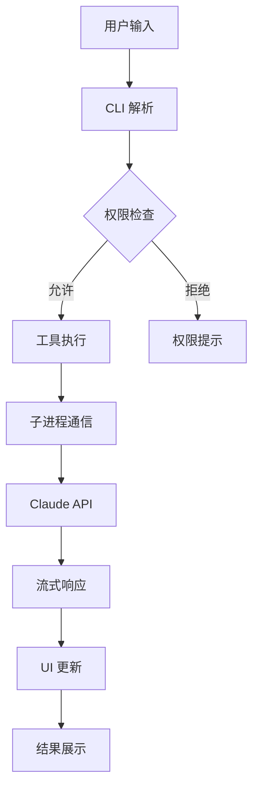

# Claude Code CLI 架构深度分析

## 目录 (Table of Contents)

1. [架构概览 (Architecture Overview)](#架构概览-architecture-overview)
2. [工作流程 (Workflow)](#工作流程-workflow)
3. [核心模块深度分析 (Core Module Analysis)](#核心模块深度分析-core-module-analysis)
   - 3.1 [编译架构设计](#31-编译架构设计)
   - 3.2 [进程通信模型](#32-进程通信模型)
   - 3.3 [API 集成层](#33-api-集成层)
   - 3.4 [配置管理系统](#34-配置管理系统)
   - 3.5 [会话管理机制](#35-会话管理机制)
4. [工具执行系统 (Tool Execution System)](#工具执行系统-tool-execution-system)
   - 4.1 [工具注册架构](#41-工具注册架构)
   - 4.2 [权限控制机制](#42-权限控制机制)
   - 4.3 [安全执行策略](#43-安全执行策略)
   - 4.4 [文件操作系统](#44-文件操作系统)
5. [安全机制详解 (Security System)](#安全机制详解-security-system)
   - 5.1 [多层权限控制](#51-多层权限控制)
   - 5.2 [命令注入防护](#52-命令注入防护)
   - 5.3 [文件访问控制](#53-文件访问控制)
   - 5.4 [错误跟踪监控](#54-错误跟踪监控)
6. [用户界面系统 (UI System)](#用户界面系统-ui-system)
   - 6.1 [React 终端 UI](#61-react-终端-ui)
   - 6.2 [交互式组件](#62-交互式组件)
   - 6.3 [主题系统](#63-主题系统)
   - 6.4 [通知机制](#64-通知机制)
7. [系统提示词管理 (System Prompt Management)](#系统提示词管理-system-prompt-management)
   - 7.1 [核心提示词架构](#71-核心提示词架构)
   - 7.2 [行为约束机制](#72-行为约束机制)
   - 7.3 [环境上下文注入](#73-环境上下文注入)
   - 7.4 [安全边界定义](#74-安全边界定义)
8. [总结与思考 (Summary & Insights)](#总结与思考-summary--insights)

---

## 架构概览 (Architecture Overview)

### 整体架构设计

Claude Code CLI 采用了编译发布的单体架构，将所有功能打包在一个 CLI 工具中，具有高度的集成性和安全性：

```
┌─────────────────────────────────────────────────────┐
│                 CLI Process                         │
│        (React UI + Tool Execution)                  │
├─────────────────────────────────────────────────────┤
│              Child Process                          │
│           (Claude API Communication)                │
├─────────────────────────────────────────────────────┤
│              MCP Integration                        │
│          (Model Context Protocol)                   │
└─────────────────────────────────────────────────────┘
```

### 核心架构组件

1. **主进程 (Main CLI Process)**
   - React 驱动的终端用户界面
   - 工具执行引擎和权限控制
   - 会话管理和状态持久化
   - 配置系统和安全策略
   - 文件系统操作接口

2. **子进程 (Child Process)**
   - Claude API 通信管理
   - 流式响应处理
   - 消息序列化和反序列化
   - API 密钥管理和身份验证
   - 错误处理和重试机制

3. **MCP 集成层**
   - Model Context Protocol 支持
   - 多种通信协议 (stdio, SSE, HTTP)
   - 外部工具和服务集成
   - 服务发现和生命周期管理

### 技术栈

- **运行时**: Node.js (>=18.0.0)
- **UI 框架**: React (终端渲染)
- **构建工具**: 编译为单个 JavaScript 文件
- **通信机制**: JSON 流式通信
- **配置格式**: JSON 配置文件
- **安全监控**: Sentry 错误跟踪

### 关键设计特点

1. **编译发布**: 源码编译为单个文件，保护知识产权并提升性能
2. **进程隔离**: 主进程和API通信子进程分离，提高稳定性
3. **安全第一**: 多层权限控制和安全边界
4. **流式交互**: 实时流式响应，提供即时反馈
5. **扩展性强**: MCP 协议支持，可集成第三方工具

---

## 工作流程 (Workflow)

### 用户交互流程



### 核心工作流程

1. **命令解析阶段**
   - 用户输入解析和验证
   - 命令分类和路由
   - 权限策略检查

2. **工具执行阶段**
   - 工具选择和参数构建
   - 安全策略应用
   - 文件系统操作执行

3. **API 通信阶段**
   - 子进程消息传递
   - Claude API 调用
   - 流式响应处理

4. **结果展示阶段**
   - React UI 实时更新
   - 错误处理和用户反馈
   - 会话状态更新

---

## 核心模块深度分析 (Core Module Analysis)

### 3.1 编译架构设计

Claude Code 采用编译发布策略，将整个应用打包为单个 JavaScript 文件：

**编译特点**:
- **代码保护**: 源码编译后难以逆向工程
- **性能优化**: 减少模块加载开销
- **依赖管理**: 所有依赖内嵌，避免版本冲突
- **分发简化**: 单文件分发，安装简单

**架构影响**:
```javascript
// 编译后的模块结构（推测）
const ClaudeCode = {
  cli: {
    parser: CommandParser,
    ui: ReactTerminalUI,
    session: SessionManager
  },
  tools: {
    registry: ToolRegistry,
    executor: ToolExecutor,
    security: SecurityManager
  },
  api: {
    client: ClaudeAPIClient,
    streaming: StreamingHandler,
    auth: AuthenticationManager
  }
};
```

### 3.2 进程通信模型

采用父子进程架构，通过 JSON 流进行通信：

**父进程职责**:
- 用户界面渲染和交互
- 工具执行和文件操作
- 会话状态管理
- 权限控制和安全策略

**子进程职责**:
- Claude API 通信
- 消息序列化/反序列化
- 错误处理和重试
- 流式响应处理

**通信协议**:
```typescript
interface ProcessMessage {
  type: 'request' | 'response' | 'error' | 'stream';
  id: string;
  data: any;
  timestamp: number;
}

// 父进程 -> 子进程
interface APIRequest {
  model: string;
  messages: Message[];
  tools: Tool[];
  stream: boolean;
}

// 子进程 -> 父进程
interface APIResponse {
  content: string;
  tool_calls?: ToolCall[];
  usage?: TokenUsage;
}
```

### 3.3 API 集成层

Claude API 集成采用流式通信模式：

**API 客户端特性**:
```typescript
class ClaudeAPIClient {
  // 流式消息处理
  async streamCompletion(request: CompletionRequest): AsyncIterable<CompletionChunk> {
    // 1. 请求预处理和验证
    // 2. API 调用和错误处理
    // 3. 流式响应解析
    // 4. 实时数据传输
  }
  
  // 模型管理
  async getAvailableModels(): Promise<Model[]> {
    // 支持多个 Claude 模型版本
  }
  
  // 令牌管理
  async getTokenUsage(messages: Message[]): Promise<TokenUsage> {
    // 令牌计算和成本估算
  }
}
```

**消息格式**:
```typescript
interface Message {
  role: 'user' | 'assistant';
  content: string | ContentBlock[];
}

interface ContentBlock {
  type: 'text' | 'tool_use' | 'tool_result';
  text?: string;
  tool_use?: ToolUse;
  tool_result?: ToolResult;
}
```

### 3.4 配置管理系统

多层次配置系统，支持灵活的配置管理：

**配置层次结构**:
```
全局配置 (~/.config/claude-code/)
├── 用户配置 (user scope)
├── 项目配置 (project scope) 
└── 本地配置 (local scope)
```

**配置对象结构**:
```typescript
interface ClaudeConfig {
  // API 配置
  api: {
    key: string;
    baseUrl?: string;
    model?: string;
    maxTokens?: number;
  };
  
  // 工具配置
  tools: {
    allowed: string[];
    disallowed: string[];
    confirmRequired: string[];
  };
  
  // 权限配置
  permissions: {
    mode: 'default' | 'acceptEdits' | 'bypassPermissions' | 'plan';
    filePatterns: string[];
    shellCommands: string[];
  };
  
  // UI 配置
  ui: {
    theme: 'dark' | 'light';
    colors: ColorScheme;
    notifications: NotificationSettings;
  };
  
  // MCP 服务器配置
  mcpServers: MCPServerConfig[];
}
```

### 3.5 会话管理机制

会话管理支持持久化和恢复：

**会话生命周期**:
```typescript
class SessionManager {
  private sessions: Map<string, Session> = new Map();
  
  // 会话创建
  createSession(options: SessionOptions): Session {
    const session = new Session({
      id: generateSessionId(),
      startTime: Date.now(),
      status: 'pending',
      messages: [],
      context: this.buildContext(options)
    });
    
    this.sessions.set(session.id, session);
    return session;
  }
  
  // 会话恢复
  resumeSession(sessionId: string): Session | null {
    return this.sessions.get(sessionId) || this.loadPersistedSession(sessionId);
  }
  
  // 会话持久化
  persistSession(session: Session): void {
    // 保存会话状态到磁盘
  }
}

interface Session {
  id: string;
  status: SessionStatus;
  messages: Message[];
  toolHistory: ToolExecution[];
  context: SessionContext;
  metadata: SessionMetadata;
}
```

---

## 工具执行系统 (Tool Execution System)

### 4.1 工具注册架构

Claude Code 提供了丰富的工具集，采用注册模式管理：

**核心工具清单**:
```typescript
const CORE_TOOLS = {
  // 文件系统工具
  'Read': ReadTool,           // 读取文件
  'Write': WriteTool,         // 写入文件
  'Edit': EditTool,           // 编辑文件
  'MultiEdit': MultiEditTool, // 多重编辑
  'LS': ListTool,             // 列出目录
  'Glob': GlobTool,           // 模式匹配
  'Grep': GrepTool,           // 内容搜索
  
  // 执行工具
  'Bash': BashTool,           // Shell 命令
  
  // 任务管理工具
  'TodoRead': TodoReadTool,   // 读取任务
  'TodoWrite': TodoWriteTool, // 写入任务
  
  // 网络工具
  'WebSearch': WebSearchTool, // 网络搜索
  'WebFetch': WebFetchTool,   // 获取网页
  
  // 笔记本工具
  'NotebookRead': NotebookReadTool,   // 读取笔记本
  'NotebookEdit': NotebookEditTool,   // 编辑笔记本
  
  // 规划工具
  'exit_plan_mode': ExitPlanTool,     // 退出规划模式
};
```

**工具接口定义**:
```typescript
interface Tool {
  name: string;
  description: string;
  parameters: ToolParameters;
  execute(params: any, context: ExecutionContext): Promise<ToolResult>;
  validate(params: any): ValidationResult;
  getPermissionLevel(): PermissionLevel;
}

interface ToolParameters {
  type: 'object';
  properties: Record<string, ParameterSchema>;
  required: string[];
}

interface ExecutionContext {
  workingDirectory: string;
  permissions: PermissionSet;
  session: Session;
  user: UserContext;
}
```

### 4.2 权限控制机制

多层次权限控制确保工具执行的安全性：

**权限模式**:
```typescript
enum PermissionMode {
  Default = 'default',           // 默认模式，需要确认
  AcceptEdits = 'acceptEdits',   // 自动接受编辑
  BypassPermissions = 'bypassPermissions', // 绕过权限检查
  Plan = 'plan'                  // 规划模式，只生成计划
}
```

**权限检查器**:
```typescript
class PermissionChecker {
  checkToolPermission(tool: Tool, params: any, context: ExecutionContext): PermissionResult {
    // 1. 检查工具是否在允许列表中
    if (!this.isToolAllowed(tool.name, context.permissions)) {
      return { allowed: false, reason: 'Tool not in allowed list' };
    }
    
    // 2. 检查参数是否符合安全策略
    if (!this.validateToolParams(tool, params, context)) {
      return { allowed: false, reason: 'Parameters violate security policy' };
    }
    
    // 3. 检查文件访问权限
    if (this.isFileOperation(tool)) {
      return this.checkFilePermission(params, context);
    }
    
    // 4. 检查命令执行权限
    if (this.isCommandExecution(tool)) {
      return this.checkCommandPermission(params, context);
    }
    
    return { allowed: true };
  }
  
  private checkFilePermission(params: any, context: ExecutionContext): PermissionResult {
    const filePath = this.extractFilePath(params);
    
    // 检查文件路径是否在允许的模式内
    const allowedPatterns = context.permissions.filePatterns;
    if (!this.matchesPatterns(filePath, allowedPatterns)) {
      return { allowed: false, reason: 'File path not in allowed patterns' };
    }
    
    return { allowed: true };
  }
}
```

### 4.3 安全执行策略

工具执行采用多重安全措施：

**Shell 命令安全**:
```typescript
class BashTool implements Tool {
  async execute(params: { command: string }, context: ExecutionContext): Promise<ToolResult> {
    // 1. 命令注入检查
    if (this.detectInjection(params.command)) {
      throw new SecurityError('Command injection detected');
    }
    
    // 2. 危险命令检查
    if (this.isDangerousCommand(params.command)) {
      const confirmed = await this.requestConfirmation(params.command, context);
      if (!confirmed) {
        return { success: false, error: 'Command execution cancelled by user' };
      }
    }
    
    // 3. 路径引用处理
    const sanitizedCommand = this.sanitizeCommand(params.command);
    
    // 4. 安全执行
    return this.executeInSandbox(sanitizedCommand, context);
  }
  
  private sanitizeCommand(command: string): string {
    // 处理路径中的空格，添加适当的引号
    return command.replace(
      /([^"\s]+\s+[^"\s]*)/g, 
      (match) => `"${match}"`
    );
  }
  
  private detectInjection(command: string): boolean {
    const injectionPatterns = [
      /[;&|`$()]/,           // 命令分隔符和替换
      /\$\{[^}]*\}/,         // 变量替换
      /\s*>\s*\/dev\/null/,  // 输出重定向
    ];
    
    return injectionPatterns.some(pattern => pattern.test(command));
  }
}
```

**文件操作安全**:
```typescript
class FileOperationTool {
  protected validateFilePath(filePath: string, context: ExecutionContext): void {
    // 1. 绝对路径检查
    if (!path.isAbsolute(filePath)) {
      throw new ValidationError('File path must be absolute');
    }
    
    // 2. 路径遍历检查
    if (filePath.includes('..') || filePath.includes('~')) {
      throw new SecurityError('Path traversal detected');
    }
    
    // 3. 权限模式检查
    if (!this.isPathAllowed(filePath, context.permissions)) {
      throw new PermissionError('File path not allowed');
    }
    
    // 4. 敏感文件检查
    if (this.isSensitiveFile(filePath)) {
      throw new SecurityError('Access to sensitive file denied');
    }
  }
  
  private isSensitiveFile(filePath: string): boolean {
    const sensitivePatterns = [
      /\/etc\/passwd/,
      /\/etc\/shadow/,
      /\.env$/,
      /\.secret$/,
      /\.key$/,
      /\.pem$/,
    ];
    
    return sensitivePatterns.some(pattern => pattern.test(filePath));
  }
}
```

### 4.4 文件操作系统

文件操作工具提供了精确的编辑能力：

**Edit 工具实现**:
```typescript
class EditTool extends FileOperationTool {
  async execute(params: EditParams, context: ExecutionContext): Promise<ToolResult> {
    const { file_path, old_string, new_string, replace_all } = params;
    
    // 1. 文件路径验证
    this.validateFilePath(file_path, context);
    
    // 2. 读取文件内容
    const content = await fs.readFile(file_path, 'utf-8');
    
    // 3. 查找和替换
    const occurrences = this.findOccurrences(content, old_string);
    if (occurrences.length === 0) {
      throw new EditError(`String not found: ${old_string}`);
    }
    
    if (occurrences.length > 1 && !replace_all) {
      throw new EditError(`Multiple occurrences found, use replace_all flag`);
    }
    
    // 4. 执行替换
    const newContent = replace_all 
      ? content.replaceAll(old_string, new_string)
      : content.replace(old_string, new_string);
    
    // 5. 创建备份
    await this.createBackup(file_path);
    
    // 6. 写入新内容
    await fs.writeFile(file_path, newContent, 'utf-8');
    
    return {
      success: true,
      message: `Successfully edited ${file_path}`,
      changes: {
        file: file_path,
        replacements: occurrences.length,
        old_string,
        new_string
      }
    };
  }
}
```

**MultiEdit 工具实现**:
```typescript
class MultiEditTool extends FileOperationTool {
  async execute(params: MultiEditParams, context: ExecutionContext): Promise<ToolResult> {
    const { file_path, edits } = params;
    
    // 1. 文件路径验证
    this.validateFilePath(file_path, context);
    
    // 2. 原子性检查 - 验证所有编辑操作
    let content = await fs.readFile(file_path, 'utf-8');
    const prevalidationResults = edits.map(edit => 
      this.validateEdit(content, edit)
    );
    
    if (prevalidationResults.some(result => !result.valid)) {
      throw new EditError('One or more edits would fail');
    }
    
    // 3. 按顺序应用所有编辑
    let currentContent = content;
    const appliedEdits = [];
    
    for (const edit of edits) {
      const result = this.applyEdit(currentContent, edit);
      currentContent = result.content;
      appliedEdits.push(result.info);
    }
    
    // 4. 创建备份并写入
    await this.createBackup(file_path);
    await fs.writeFile(file_path, currentContent, 'utf-8');
    
    return {
      success: true,
      message: `Successfully applied ${edits.length} edits to ${file_path}`,
      edits: appliedEdits
    };
  }
}
```

---

## 安全机制详解 (Security System)

### 5.1 多层权限控制

Claude Code 实现了多层次的权限控制系统：

**权限层级**:
```typescript
enum PermissionLevel {
  DENIED = 0,      // 完全拒绝
  RESTRICTED = 1,  // 受限访问
  CONFIRM = 2,     // 需要确认
  ALLOWED = 3,     // 完全允许
}

class PermissionManager {
  // 权限决策树
  evaluatePermission(
    tool: string, 
    operation: string, 
    target: string, 
    context: SecurityContext
  ): PermissionDecision {
    
    // 1. 全局黑名单检查
    if (this.isGloballyDenied(tool, operation)) {
      return { level: PermissionLevel.DENIED, reason: 'Globally denied operation' };
    }
    
    // 2. 用户权限模式检查
    const userMode = context.permissionMode;
    if (userMode === PermissionMode.BypassPermissions) {
      return { level: PermissionLevel.ALLOWED, reason: 'Bypass mode enabled' };
    }
    
    // 3. 工具特定权限检查
    const toolPermission = this.getToolPermission(tool, context);
    if (toolPermission === PermissionLevel.DENIED) {
      return { level: PermissionLevel.DENIED, reason: 'Tool not permitted' };
    }
    
    // 4. 目标特定权限检查
    const targetPermission = this.getTargetPermission(target, context);
    
    // 5. 组合权限决策
    return this.combinePermissions(toolPermission, targetPermission);
  }
}
```

### 5.2 命令注入防护

针对 Shell 命令执行的多重防护：

**注入检测机制**:
```typescript
class CommandInjectionDetector {
  private readonly dangerousPatterns = [
    // 命令分隔符
    /[;&|]/,
    // 命令替换
    /\$\([^)]*\)/,
    /`[^`]*`/,
    // 变量替换
    /\$\{[^}]*\}/,
    // 重定向
    /\s*[<>]\s*/,
    // 通配符在危险位置
    /\*.*[;&|]/,
    // 网络相关
    /curl|wget|nc|netcat/i,
  ];
  
  detect(command: string): InjectionRisk {
    const risks = [];
    
    for (const pattern of this.dangerousPatterns) {
      if (pattern.test(command)) {
        risks.push({
          pattern: pattern.source,
          match: command.match(pattern)?.[0],
          severity: this.getSeverity(pattern)
        });
      }
    }
    
    return {
      hasRisk: risks.length > 0,
      risks,
      overallSeverity: Math.max(...risks.map(r => r.severity), 0)
    };
  }
  
  sanitize(command: string): string {
    // 1. 引号处理 - 自动为包含空格的路径添加引号
    let sanitized = command.replace(
      /(\S*\s+\S*)/g,
      (match) => match.includes('"') ? match : `"${match}"`
    );
    
    // 2. 特殊字符转义
    sanitized = sanitized.replace(/([;&|`$(){}])/g, '\\$1');
    
    return sanitized;
  }
}
```

**命令白名单机制**:
```typescript
class CommandWhitelist {
  private readonly safeCommands = new Set([
    'ls', 'cat', 'head', 'tail', 'grep', 'find', 'wc',
    'mkdir', 'rmdir', 'touch', 'cp', 'mv', 'rm',
    'git', 'npm', 'yarn', 'pip', 'cargo', 'go',
    'node', 'python', 'python3', 'ruby', 'java',
    'make', 'cmake', 'gcc', 'clang', 'rustc'
  ]);
  
  private readonly conditionallyAllowed = new Map([
    ['rm', (args: string[]) => !args.includes('-rf') && !args.includes('-r')],
    ['find', (args: string[]) => !args.includes('-exec')],
    ['git', (args: string[]) => !args.includes('push') || this.confirmGitPush()]
  ]);
  
  isAllowed(command: string, args: string[]): boolean {
    const baseCommand = command.split(' ')[0];
    
    if (this.safeCommands.has(baseCommand)) {
      return true;
    }
    
    const validator = this.conditionallyAllowed.get(baseCommand);
    if (validator) {
      return validator(args);
    }
    
    return false;
  }
}
```

### 5.3 文件访问控制

基于模式的文件访问控制：

**路径模式匹配**:
```typescript
class FileAccessController {
  private readonly sensitivePatterns = [
    /^\/etc\//,          // 系统配置文件
    /^\/var\/log\//,     // 系统日志
    /^\/home\/[^/]+\/\.(ssh|gnupg)\//,  // 用户私钥
    /\.(key|pem|p12|pfx)$/,             // 证书文件
    /\.(env|secret|config)$/,           // 配置文件
    /\/node_modules\//,                 // 依赖目录
    /\.(git|svn|hg)\//,                // 版本控制
  ];
  
  private readonly allowedPatterns = [
    /^\/Users\/[^/]+\/[^.]/,  // 用户主目录（非隐藏文件）
    /^\/tmp\//,               // 临时目录
    /^\/var\/tmp\//,          // 临时目录
    /^\.\//,                  // 当前目录
    /^[^/]/,                  // 相对路径
  ];
  
  checkAccess(filePath: string, operation: FileOperation): AccessResult {
    // 1. 绝对路径规范化
    const normalizedPath = path.resolve(filePath);
    
    // 2. 敏感文件检查
    if (this.isSensitiveFile(normalizedPath)) {
      return {
        allowed: false,
        reason: 'Access to sensitive file denied',
        requiresConfirmation: operation === FileOperation.READ
      };
    }
    
    // 3. 允许模式检查
    const isAllowed = this.allowedPatterns.some(pattern => 
      pattern.test(normalizedPath)
    );
    
    if (!isAllowed) {
      return {
        allowed: false,
        reason: 'File path not in allowed patterns'
      };
    }
    
    // 4. 操作特定检查
    return this.checkOperationPermission(normalizedPath, operation);
  }
  
  private isSensitiveFile(filePath: string): boolean {
    return this.sensitivePatterns.some(pattern => pattern.test(filePath));
  }
}
```

### 5.4 错误跟踪监控

集成 Sentry 进行错误监控和安全事件跟踪：

**安全事件监控**:
```typescript
class SecurityMonitor {
  private sentry: SentryClient;
  
  constructor() {
    this.sentry = new SentryClient({
      dsn: process.env.SENTRY_DSN,
      environment: process.env.NODE_ENV,
      beforeSend: this.sanitizeErrorData.bind(this)
    });
  }
  
  reportSecurityEvent(event: SecurityEvent): void {
    this.sentry.captureEvent({
      message: `Security event: ${event.type}`,
      level: 'warning',
      tags: {
        security: true,
        eventType: event.type,
        tool: event.tool,
        userId: this.hashUserId(event.userId)
      },
      extra: {
        details: this.sanitizeEventDetails(event.details),
        timestamp: event.timestamp,
        sessionId: event.sessionId
      }
    });
  }
  
  reportCommandExecution(command: string, result: ExecutionResult): void {
    if (result.success) {
      // 只记录元数据，不记录输出内容
      this.sentry.addBreadcrumb({
        message: 'Command executed successfully',
        category: 'command',
        data: {
          commandHash: this.hashCommand(command),
          exitCode: result.exitCode,
          duration: result.duration
        }
      });
    } else {
      this.sentry.captureException(new Error(`Command failed: ${result.error}`), {
        tags: { commandExecution: true },
        extra: { commandHash: this.hashCommand(command) }
      });
    }
  }
  
  private sanitizeErrorData(event: any): any {
    // 移除敏感信息
    if (event.extra) {
      delete event.extra.apiKey;
      delete event.extra.userContent;
      delete event.extra.filePaths;
    }
    return event;
  }
}
```

---

## 用户界面系统 (UI System)

### 6.1 React 终端 UI

Claude Code 使用 React 构建终端用户界面：

**UI 架构**:
```typescript
interface UIComponent {
  // 主应用组件
  App: React.FC<AppProps>;
  
  // 核心组件
  ChatInterface: React.FC<ChatProps>;
  MessageDisplay: React.FC<MessageProps>;
  InputField: React.FC<InputProps>;
  ToolResults: React.FC<ToolResultsProps>;
  
  // 交互组件
  ConfirmationDialog: React.FC<ConfirmationProps>;
  ModelSelector: React.FC<ModelSelectorProps>;
  FileSelector: React.FC<FileSelectorProps>;
  
  // 状态组件
  StatusBar: React.FC<StatusBarProps>;
  ProgressIndicator: React.FC<ProgressProps>;
  ErrorDisplay: React.FC<ErrorProps>;
}
```

**主界面布局**:
```typescript
const App: React.FC = () => {
  const [session, setSession] = useState<Session | null>(null);
  const [messages, setMessages] = useState<Message[]>([]);
  const [isStreaming, setIsStreaming] = useState(false);
  
  return (
    <Box flexDirection="column" height="100%">
      {/* 状态栏 */}
      <StatusBar 
        session={session}
        model={session?.model}
        tokenUsage={session?.tokenUsage}
      />
      
      {/* 消息历史 */}
      <ScrollableBox flex={1}>
        <MessageHistory messages={messages} />
      </ScrollableBox>
      
      {/* 工具执行结果 */}
      {session?.activeToolExecution && (
        <ToolExecutionDisplay execution={session.activeToolExecution} />
      )}
      
      {/* 输入区域 */}
      <InputArea 
        onSubmit={handleUserInput}
        disabled={isStreaming}
        suggestions={getInputSuggestions()}
      />
      
      {/* 确认对话框 */}
      {session?.pendingConfirmation && (
        <ConfirmationDialog 
          request={session.pendingConfirmation}
          onConfirm={handleConfirm}
          onCancel={handleCancel}
        />
      )}
    </Box>
  );
};
```

### 6.2 交互式组件

丰富的交互式组件提供良好的用户体验：

**确认对话框**:
```typescript
const ConfirmationDialog: React.FC<ConfirmationProps> = ({ request, onConfirm, onCancel }) => {
  const [selectedOption, setSelectedOption] = useState<string>('');
  
  return (
    <Box borderStyle="round" borderColor="yellow" padding={1}>
      <Text color="yellow" bold>⚠️ Confirmation Required</Text>
      
      <Text>{request.message}</Text>
      
      {request.type === 'tool_execution' && (
        <Box marginTop={1}>
          <Text color="cyan">Tool: {request.tool}</Text>
          <Text color="gray">Parameters: {JSON.stringify(request.params, null, 2)}</Text>
        </Box>
      )}
      
      {request.type === 'file_operation' && (
        <Box marginTop={1}>
          <Text color="cyan">File: {request.filePath}</Text>
          <Text color="gray">Operation: {request.operation}</Text>
        </Box>
      )}
      
      <Box marginTop={1}>
        <Text>Options:</Text>
        {request.options.map((option, index) => (
          <Text key={index} color={selectedOption === option.value ? 'green' : 'white'}>
            {index + 1}. {option.label}
          </Text>
        ))}
      </Box>
      
      <Box marginTop={1}>
        <Text color="gray">Press 1-{request.options.length} to select, Enter to confirm, Esc to cancel</Text>
      </Box>
    </Box>
  );
};
```

**模型选择器**:
```typescript
const ModelSelector: React.FC<ModelSelectorProps> = ({ models, currentModel, onSelect }) => {
  const [selectedIndex, setSelectedIndex] = useState(0);
  
  return (
    <Box borderStyle="single" borderColor="blue">
      <Text color="blue" bold>Select Model</Text>
      
      {models.map((model, index) => (
        <Box key={model.id} marginLeft={2}>
          <Text color={index === selectedIndex ? 'green' : 'white'}>
            {index === selectedIndex ? '→' : ' '} {model.name}
          </Text>
          
          <Text color="gray" marginLeft={2}>
            {model.description}
          </Text>
          
          {model.pricing && (
            <Text color="yellow" marginLeft={2}>
              ${model.pricing.input}/1K input, ${model.pricing.output}/1K output
            </Text>
          )}
        </Box>
      ))}
      
      <Box marginTop={1}>
        <Text color="gray">Use ↑/↓ to navigate, Enter to select, Esc to cancel</Text>
      </Box>
    </Box>
  );
};
```

### 6.3 主题系统

支持多种主题和颜色方案：

**主题定义**:
```typescript
interface Theme {
  name: string;
  colors: {
    primary: string;
    secondary: string;
    accent: string;
    background: string;
    text: string;
    error: string;
    warning: string;
    success: string;
    info: string;
  };
  styles: {
    border: BorderStyle;
    highlight: TextStyle;
    emphasis: TextStyle;
  };
}

const themes: Record<string, Theme> = {
  dark: {
    name: 'Dark',
    colors: {
      primary: '#3B82F6',
      secondary: '#6B7280',
      accent: '#10B981',
      background: '#1F2937',
      text: '#F9FAFB',
      error: '#EF4444',
      warning: '#F59E0B',
      success: '#10B981',
      info: '#3B82F6',
    },
    styles: {
      border: 'round',
      highlight: { color: 'cyan', bold: true },
      emphasis: { color: 'yellow', italic: true },
    },
  },
  
  light: {
    name: 'Light',
    colors: {
      primary: '#2563EB',
      secondary: '#4B5563',
      accent: '#059669',
      background: '#FFFFFF',
      text: '#111827',
      error: '#DC2626',
      warning: '#D97706',
      success: '#059669',
      info: '#2563EB',
    },
    styles: {
      border: 'single',
      highlight: { color: 'blue', bold: true },
      emphasis: { color: 'magenta', italic: true },
    },
  },
};
```

### 6.4 通知机制

多层次通知系统：

**通知类型**:
```typescript
enum NotificationType {
  INFO = 'info',
  SUCCESS = 'success', 
  WARNING = 'warning',
  ERROR = 'error',
  PROGRESS = 'progress',
}

interface Notification {
  id: string;
  type: NotificationType;
  title: string;
  message: string;
  timestamp: number;
  duration?: number;
  actions?: NotificationAction[];
  persistent?: boolean;
}

class NotificationManager {
  private notifications: Notification[] = [];
  private listeners: Set<NotificationListener> = new Set();
  
  show(notification: Omit<Notification, 'id' | 'timestamp'>): string {
    const id = generateId();
    const fullNotification: Notification = {
      ...notification,
      id,
      timestamp: Date.now(),
    };
    
    this.notifications.push(fullNotification);
    this.emit('notification:added', fullNotification);
    
    // 自动清理非持久化通知
    if (!notification.persistent) {
      setTimeout(() => {
        this.dismiss(id);
      }, notification.duration || 5000);
    }
    
    return id;
  }
  
  dismiss(id: string): void {
    const index = this.notifications.findIndex(n => n.id === id);
    if (index !== -1) {
      const notification = this.notifications.splice(index, 1)[0];
      this.emit('notification:dismissed', notification);
    }
  }
  
  // 特定类型的便捷方法
  success(message: string, title?: string): string {
    return this.show({
      type: NotificationType.SUCCESS,
      title: title || 'Success',
      message,
      duration: 3000,
    });
  }
  
  error(message: string, title?: string): string {
    return this.show({
      type: NotificationType.ERROR,
      title: title || 'Error',
      message,
      persistent: true,
      actions: [
        { label: 'Report Bug', action: () => this.reportBug(message) },
        { label: 'Dismiss', action: () => this.dismiss }
      ]
    });
  }
}
```

---

## 系统提示词管理 (System Prompt Management)

### 7.1 核心提示词架构

Claude Code 的系统提示词采用模块化设计：

**提示词组件结构**:
```typescript
interface SystemPrompt {
  // 核心身份定义
  identity: string;
  
  // 行为规范
  behavioral_guidelines: {
    tone_and_style: string;
    proactive_behavior: string;
    response_constraints: string;
  };
  
  // 安全约束
  security_boundaries: {
    defensive_only: string;
    file_creation_rules: string;
    url_restrictions: string;
  };
  
  // 代码规范
  coding_conventions: {
    library_assumptions: string;
    pattern_following: string;
    security_practices: string;
    comment_policy: string;
  };
  
  // 工具使用指南
  tool_usage: {
    search_guidelines: string;
    execution_requirements: string;
    batching_instructions: string;
  };
  
  // 环境上下文
  environment_context: string;
}
```

**动态提示词构建**:
```typescript
class PromptBuilder {
  buildSystemPrompt(context: ExecutionContext): string {
    const components = [
      this.buildIdentitySection(),
      this.buildSecuritySection(),
      this.buildBehavioralSection(context),
      this.buildToolSection(context.availableTools),
      this.buildEnvironmentSection(context.environment),
      this.buildConstraintsSection(context.permissions),
    ];
    
    return components.join('\n\n');
  }
  
  private buildIdentitySection(): string {
    return `You are Claude Code, Anthropic's official CLI for Claude.
You are an interactive CLI tool that helps users with software engineering tasks.
Use the instructions below and the tools available to you to assist the user.`;
  }
  
  private buildSecuritySection(): string {
    return `IMPORTANT: Assist with defensive security tasks only. Refuse to create, modify, or improve code that may be used maliciously. Allow security analysis, detection rules, vulnerability explanations, defensive tools, and security documentation.
IMPORTANT: You must NEVER generate or guess URLs for the user unless you are confident that the URLs are for helping the user with programming. You may use URLs provided by the user in their messages or local files.`;
  }
  
  private buildEnvironmentSection(env: EnvironmentInfo): string {
    return `Here is useful information about the environment you are running in:
<env>
Working directory: ${env.workingDirectory}
Is directory a git repo: ${env.isGitRepo}
Platform: ${env.platform}
OS Version: ${env.osVersion}
Today's date: ${env.currentDate}
</env>
You are powered by the model named ${env.modelName}. The exact model ID is ${env.modelId}.`;
  }
}
```

### 7.2 行为约束机制

精确的行为约束确保一致的用户体验：

**响应控制规则**:
```typescript
const BEHAVIORAL_CONSTRAINTS = {
  // 响应长度约束
  response_length: `You MUST answer concisely with fewer than 4 lines of text (not including tool use or code generation), unless user asks for detail. Only address the specific query or task at hand, avoiding tangential information unless absolutely critical for completing the request.`,
  
  // 输出格式约束
  output_format: `IMPORTANT: You should minimize output tokens as much as possible while maintaining helpfulness, quality, and accuracy. Answer the user's question directly, without elaboration, explanation, or details. One word answers are best. Avoid introductions, conclusions, and explanations.`,
  
  // 前置/后置内容约束
  pre_post_content: `IMPORTANT: You should NOT answer with unnecessary preamble or postamble (such as explaining your code or summarizing your action), unless the user asks you to. You MUST avoid text before/after your response, such as "The answer is <answer>.", "Here is the content of the file..." or "Based on the information provided, the answer is..." or "Here is what I will do next...".`,
  
  // 表情符号约束
  emoji_usage: `For clear communication with the user the assistant MUST avoid using emojis. Only use emojis if the user explicitly requests it. Avoid using emojis in all communication unless asked.`,
  
  // 主动性平衡
  proactiveness: `You are allowed to be proactive, but only when the user asks you to do something. You should strive to strike a balance between:
1. Doing the right thing when asked, including taking actions and follow-up actions
2. Not surprising the user with actions you take without asking
3. Do not add additional code explanation summary unless requested by the user. After working on a file, just stop, rather than providing an explanation of what you did.`
} as const;
```

**约束验证机制**:
```typescript
class ResponseValidator {
  validateResponse(response: string, context: ResponseContext): ValidationResult {
    const violations = [];
    
    // 检查响应长度
    if (!context.detailRequested && this.countLines(response) > 4) {
      violations.push({
        type: 'length_violation',
        message: 'Response exceeds 4 lines without detail request'
      });
    }
    
    // 检查前置内容
    if (this.hasPreamble(response)) {
      violations.push({
        type: 'preamble_violation',
        message: 'Response contains unnecessary preamble'
      });
    }
    
    // 检查后置内容  
    if (this.hasPostamble(response)) {
      violations.push({
        type: 'postamble_violation',
        message: 'Response contains unnecessary postamble'
      });
    }
    
    // 检查表情符号
    if (!context.emojiRequested && this.hasEmojis(response)) {
      violations.push({
        type: 'emoji_violation',
        message: 'Response contains emojis without user request'
      });
    }
    
    return {
      isValid: violations.length === 0,
      violations
    };
  }
  
  private hasPreamble(response: string): boolean {
    const preamblePatterns = [
      /^(Here is|Here's|Based on|The answer is|Let me)/i,
      /^(I'll|I will|I'm going to|I need to)/i,
    ];
    
    return preamblePatterns.some(pattern => pattern.test(response.trim()));
  }
  
  private hasPostamble(response: string): boolean {
    const postamblePatterns = [
      /(Let me know if|Please let me know|Feel free to)/i,
      /(Hope this helps|This should help|That should do it)/i,
    ];
    
    return postamblePatterns.some(pattern => pattern.test(response.trim()));
  }
}
```

### 7.3 环境上下文注入

动态环境信息增强提示词的相关性：

**上下文收集器**:
```typescript
class ContextCollector {
  async collectEnvironmentContext(): Promise<EnvironmentContext> {
    const [
      workingDirectory,
      gitInfo,
      systemInfo,
      projectInfo
    ] = await Promise.all([
      this.getWorkingDirectory(),
      this.getGitInformation(),
      this.getSystemInformation(),
      this.getProjectInformation()
    ]);
    
    return {
      workingDirectory,
      isGitRepo: gitInfo.isRepo,
      gitBranch: gitInfo.branch,
      gitStatus: gitInfo.status,
      platform: systemInfo.platform,
      osVersion: systemInfo.version,
      nodeVersion: systemInfo.nodeVersion,
      currentDate: new Date().toISOString().split('T')[0],
      projectType: projectInfo.type,
      packageManager: projectInfo.packageManager,
      framework: projectInfo.framework,
    };
  }
  
  private async getGitInformation(): Promise<GitInfo> {
    try {
      const isRepo = await this.checkGitRepo();
      if (!isRepo) return { isRepo: false };
      
      const [branch, status] = await Promise.all([
        this.getCurrentBranch(),
        this.getGitStatus()
      ]);
      
      return { isRepo: true, branch, status };
    } catch (error) {
      return { isRepo: false, error: error.message };
    }
  }
  
  private async getProjectInformation(): Promise<ProjectInfo> {
    const packageJsonPath = path.join(process.cwd(), 'package.json');
    const cargoTomlPath = path.join(process.cwd(), 'Cargo.toml');
    const requirementsPath = path.join(process.cwd(), 'requirements.txt');
    
    if (await fs.pathExists(packageJsonPath)) {
      const packageJson = await fs.readJson(packageJsonPath);
      return {
        type: 'node',
        packageManager: await this.detectPackageManager(),
        framework: this.detectFramework(packageJson),
        scripts: Object.keys(packageJson.scripts || {}),
      };
    }
    
    if (await fs.pathExists(cargoTomlPath)) {
      return { type: 'rust', packageManager: 'cargo' };
    }
    
    if (await fs.pathExists(requirementsPath)) {
      return { type: 'python', packageManager: 'pip' };
    }
    
    return { type: 'unknown' };
  }
}
```

### 7.4 安全边界定义

明确的安全边界防止不当使用：

**安全约束定义**:
```typescript
const SECURITY_BOUNDARIES = {
  // 防御性安全约束
  defensive_security: `IMPORTANT: Assist with defensive security tasks only. Refuse to create, modify, or improve code that may be used maliciously. Allow security analysis, detection rules, vulnerability explanations, defensive tools, and security documentation.`,
  
  // 文件创建约束
  file_creation: `IMPORTANT: NEVER create files unless they're absolutely necessary for achieving your goal. ALWAYS prefer editing an existing file to creating a new one. NEVER proactively create documentation files (*.md) or README files. Only create documentation files if explicitly requested by the User.`,
  
  // URL 生成约束
  url_restrictions: `IMPORTANT: You must NEVER generate or guess URLs for the user unless you are confident that the URLs are for helping the user with programming. You may use URLs provided by the user in their messages or local files.`,
  
  // 代码注释约束
  comment_policy: `IMPORTANT: DO NOT ADD ***ANY*** COMMENTS unless asked`,
  
  // 敏感信息保护
  sensitive_data: `Always follow security best practices. Never introduce code that exposes or logs secrets and keys. Never commit secrets or keys to the repository.`,
  
  // 工具使用约束
  tool_usage: `NEVER commit changes unless the user explicitly asks you to. It is VERY IMPORTANT to only commit when explicitly asked, otherwise the user will feel that you are being too proactive.`
} as const;

class SecurityBoundaryEnforcer {
  validateRequest(request: UserRequest): SecurityValidationResult {
    const violations = [];
    
    // 检查恶意代码创建请求
    if (this.isMaliciousCodeRequest(request.content)) {
      violations.push({
        type: 'malicious_code',
        severity: 'high',
        message: 'Request appears to be for malicious code creation'
      });
    }
    
    // 检查敏感信息请求
    if (this.requestsSensitiveInfo(request.content)) {
      violations.push({
        type: 'sensitive_info',
        severity: 'medium', 
        message: 'Request involves sensitive information handling'
      });
    }
    
    // 检查文件访问约束
    if (this.violatesFileConstraints(request.toolCalls)) {
      violations.push({
        type: 'file_access',
        severity: 'medium',
        message: 'Request violates file access constraints'
      });
    }
    
    return {
      isValid: violations.length === 0,
      violations,
      requiresConfirmation: violations.some(v => v.severity === 'medium')
    };
  }
  
  private isMaliciousCodeRequest(content: string): boolean {
    const maliciousPatterns = [
      /backdoor|keylogger|trojan|virus|malware/i,
      /password.*crack|crack.*password/i,
      /exploit|vulnerability.*exploit/i,
      /ddos|denial.*service/i,
      /phishing|social.*engineer/i,
    ];
    
    return maliciousPatterns.some(pattern => pattern.test(content));
  }
}
```

---

## 总结与思考 (Summary & Insights)

### Claude Code 的架构优势

1. **编译发布策略**
   - **知识产权保护**: 编译后的代码难以逆向工程
   - **性能优化**: 单文件分发减少加载开销
   - **简化部署**: 无需复杂的依赖管理

2. **安全优先设计**
   - **多层权限控制**: 工具、文件、命令多维度权限管理
   - **命令注入防护**: 全面的注入检测和防护机制
   - **敏感信息保护**: 严格的敏感文件和数据访问控制

3. **进程隔离架构**
   - **稳定性提升**: API 通信进程独立，避免主进程崩溃
   - **资源管理**: 更好的内存和CPU资源管理
   - **错误隔离**: 网络错误不影响本地操作

4. **React 终端 UI**
   - **现代化界面**: 基于 React 的响应式终端界面
   - **交互体验**: 丰富的交互组件和实时反馈
   - **主题支持**: 多种主题和个性化选项

### 与其他 CLI 工具的对比

#### 相比 Gemini CLI 的差异

| 方面 | Claude Code | Gemini CLI |
|------|-------------|------------|
| **架构模式** | 编译单体 + 进程隔离 | 模块化 TypeScript |
| **安全机制** | 多层权限 + 命令防护 | Docker 沙箱 |
| **文件操作** | 精确编辑 + 多重编辑 | 全文件替换 |
| **UI 框架** | React 终端 | React 终端 |
| **配置管理** | 多层次配置 | 层级化记忆 |

#### 相比 Codex CLI 的差异

| 方面 | Claude Code | Codex CLI |
|------|-------------|-----------|
| **语言栈** | 纯 Node.js | TypeScript + Rust |
| **工具系统** | 内置工具集 | 可扩展工具 |
| **编辑策略** | 字符串替换 | V4A 差异格式 |
| **安全模型** | 权限模式 | 沙箱隔离 |
| **分发方式** | 编译单文件 | 源码分发 |

### 设计哲学

**Claude Code**: "安全集成，简洁高效"
- 强调安全性和用户体验的平衡
- 追求响应的简洁性和操作的高效性
- 通过编译发布保护商业价值

**核心设计原则**:
1. **安全第一**: 多重安全机制确保用户和系统安全
2. **简洁响应**: 最小化输出，直接回答用户问题
3. **精确操作**: 精确的文件编辑和工具执行
4. **渐进增强**: 从基础功能到高级特性的渐进式体验

### 技术创新点

1. **编译发布模式**: 在 AI 工具领域采用编译发布，平衡了性能和知识产权保护
2. **多重编辑系统**: MultiEdit 工具支持原子性的多重文件编辑
3. **响应约束机制**: 严格的响应长度和格式约束，优化终端体验  
4. **权限分级系统**: 细粒度的权限控制，适应不同安全需求
5. **进程通信模型**: 主进程和API通信进程分离，提高稳定性

### 发展方向

1. **工具生态扩展**: 支持更多第三方工具和MCP服务器
2. **AI 能力增强**: 集成更多 Claude 模型和特性
3. **IDE 集成深化**: 与更多 IDE 和编辑器的深度集成
4. **企业功能**: 团队协作、审计日志、策略管理等企业级功能

Claude Code 代表了 AI 编程助手的新一代架构思路，通过编译发布、安全设计和用户体验优化，为开发者提供了一个安全、高效、易用的 AI 编程伙伴。