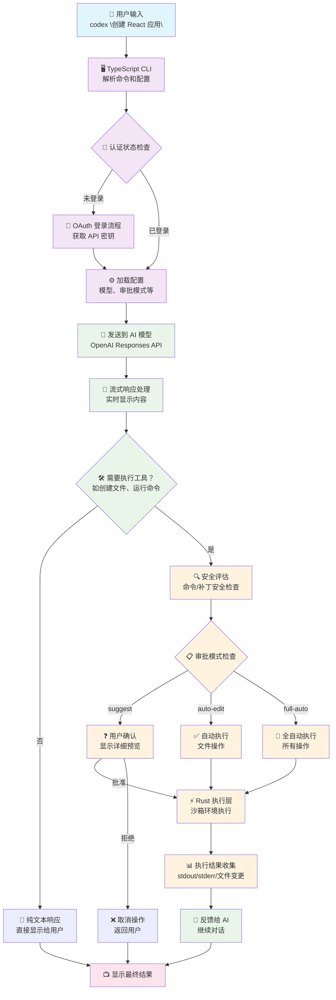
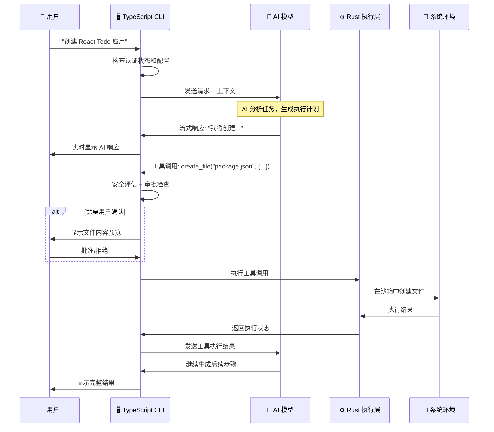

# OpenAI Codex CLI 架构深度分析

## 目录 (Table of Contents)

1. [架构概览 (Architecture Overview)](#架构概览-architecture-overview)
2. [工作流程 (Workflow)](#工作流程-workflow)
3. [核心模块深度分析 (Core Module Analysis)](#核心模块深度分析-core-module-analysis)
   - 3.1 [双语言架构设计](#31-双语言架构设计)
   - 3.2 [TypeScript CLI 层](#32-typescript-cli-层)
   - 3.3 [Rust Core 层](#33-rust-core-层)
   - 3.4 [React 终端 UI 系统](#34-react-终端-ui-系统)
   - 3.5 [Agent 执行系统](#35-agent-执行系统)
4. [工具执行系统 (Tool Execution System)](#工具执行系统-tool-execution-system)
   - 4.1 [工具调度器架构](#41-工具调度器架构)
   - 4.2 [沙箱执行机制](#42-沙箱执行机制)
   - 4.3 [MCP 工具集成](#43-mcp-工具集成)
   - 4.4 [安全审批流程](#44-安全审批流程)
5. [会话管理系统 (Session Management)](#会话管理系统-session-management)
   - 5.1 [上下文管理](#51-上下文管理)
   - 5.2 [流式响应处理](#52-流式响应处理)
   - 5.3 [状态持久化](#53-状态持久化)
6. [安全机制详解 (Security System)](#安全机制详解-security-system)
   - 6.1 [多层安全架构](#61-多层安全架构)
   - 6.2 [沙箱环境](#62-沙箱环境)
   - 6.3 [审批模式](#63-审批模式)
7. [系统提示词管理 (System Prompt Management)](#系统提示词管理-system-prompt-management)
   - 7.1 [核心提示词架构](#71-核心提示词架构)
   - 7.2 [项目文档系统](#72-项目文档系统)
   - 7.3 [工具指令集成](#73-工具指令集成)
   - 7.4 [动态上下文注入](#74-动态上下文注入)
8. [总结与思考 (Summary & Insights)](#总结与思考-summary--insights)

---

## 架构概览 (Architecture Overview)

### 整体架构设计

OpenAI Codex CLI 采用了创新的双语言混合架构，结合了 TypeScript 的开发效率和 Rust 的性能安全优势：

```
┌─────────────────────────────────────────────────────┐
│                TypeScript CLI Layer                │
│          (用户交互 & 终端 UI & API 通信)              │
├─────────────────────────────────────────────────────┤
│                  Rust Core Layer                   │
│           (执行引擎 & 沙箱 & 工具系统)                │
├─────────────────────────────────────────────────────┤
│                 System Integration                  │
│          (沙箱环境 & 文件系统 & 进程管理)              │
└─────────────────────────────────────────────────────┘
```

### 核心架构组件

1. **TypeScript CLI 层 (`codex-cli/`)** - 前端交互层
   - React 终端 UI 组件 (Ink.js 框架)
   - OpenAI API 客户端和流式处理
   - 用户交互管理 (审批、模型选择、历史记录)
   - 配置管理和多提供商支持
   - 会话状态管理

2. **Rust Core 层 (`codex-rs/`)** - 后端执行层
   - 核心执行引擎 (codex.rs)
   - 沙箱环境管理 (linux-sandbox, execpolicy)
   - 工具执行系统 (exec, apply-patch)
   - MCP 客户端/服务器 (mcp-client, mcp-server)
   - TUI 应用 (终端用户界面)

3. **集成层** - 系统集成
   - 跨平台沙箱支持 (macOS Seatbelt, Linux Landlock)
   - 文件系统操作和权限管理
   - 进程管理和信号处理
   - 网络隔离和安全策略

### 技术栈

- **前端语言**: TypeScript + React + Ink.js
- **后端语言**: Rust (2024 edition)
- **运行时**: Node.js (>=22.0.0)
- **构建工具**: ESBuild (TypeScript), Cargo (Rust)
- **测试**: Vitest (TypeScript), 标准 Rust test
- **包管理**: pnpm (TypeScript), Cargo (Rust)

### 关键设计特点

1. **双语言优势**: TypeScript 提供快速开发和丰富 UI，Rust 提供安全执行和高性能
2. **安全第一**: 多层沙箱保护，用户审批机制，命令安全评估
3. **实时交互**: 流式 API 响应，实时 UI 更新，可中断操作
4. **多模型支持**: OpenAI、Azure、Gemini、Ollama 等多种 AI 提供商
5. **扩展性**: MCP 协议支持，工具插件化，配置灵活

---

## 工作流程 (Workflow)

### 用户交互流程



### 详细执行序列

**用户输入**: "创建一个 React Todo 应用"



### 系统内部处理流程

1. **初始化阶段**: 
   - 检查 Node.js 版本 (>=22)
   - 加载配置文件 (`~/.codex/config.json`)
   - 检查认证状态 (OAuth token)
   - 初始化 AI 提供商客户端

2. **请求预处理**:
   - 解析命令行参数和选项
   - 加载项目文档 (`AGENTS.md`)
   - 检查 Git 状态和工作目录
   - 设置沙箱环境

3. **AI 交互**:
   - 构建系统提示词和上下文
   - 发送流式请求到 AI 模型
   - 实时解析和显示响应
   - 处理工具调用请求

4. **工具执行**:
   - 安全评估命令和补丁
   - 根据审批模式处理确认
   - 在 Rust 层执行工具
   - 收集和处理执行结果

5. **结果处理**:
   - 格式化显示结果
   - 更新会话状态
   - 保存历史记录
   - 发送完成通知

---

## 核心模块深度分析 (Core Module Analysis)

### 3.1 双语言架构设计

OpenAI Codex CLI 采用了独特的双语言架构，将 TypeScript 和 Rust 的优势结合：

```
TypeScript Layer (codex-cli/)
├── 用户界面和交互        (React + Ink.js)
├── AI API 通信           (OpenAI SDK)
├── 配置和会话管理        (Config + State)
└── 流式响应处理          (Streaming)

Rust Layer (codex-rs/)
├── 执行引擎             (Core Engine)
├── 沙箱环境             (Sandbox)
├── 工具系统             (Tools)
└── 系统集成             (System Integration)
```

**设计理念**:
- **TypeScript**: 快速开发，丰富的生态系统，易于调试
- **Rust**: 内存安全，高性能，系统级集成
- **清晰边界**: TypeScript 处理 UI 和 API，Rust 处理执行和安全

### 3.2 TypeScript CLI 层

#### 核心入口点

**主要文件**: `codex-cli/src/cli.tsx`

```typescript
// 核心启动逻辑
export async function main() {
  // 1. 版本检查 (Node.js >= 22)
  await checkNodeVersion();
  
  // 2. 配置加载
  const config = await loadConfig();
  
  // 3. 认证处理
  const authState = await handleAuthentication(config);
  
  // 4. 启动应用
  if (flags.quiet) {
    return runQuietMode(input, config);
  } else {
    return runInteractiveMode(input, config);
  }
}
```

#### 应用架构

**主要文件**: `codex-cli/src/app.tsx`

```typescript
const App = ({ config, initialInput }: AppProps) => {
  // 安全检查 - Git 仓库检测
  const { isInGitRepo, showGitWarning } = useGitWarning();
  
  // 主要组件渲染
  return (
    <Box flexDirection="column">
      {showGitWarning && <GitWarningScreen />}
      {showOnboarding ? (
        <OnboardingApprovalMode />
      ) : (
        <TerminalChat config={config} initialInput={initialInput} />
      )}
    </Box>
  );
};
```

**关键特性**:
- **安全优先**: 检测非 Git 目录并警告
- **用户引导**: 首次使用时的审批模式设置
- **错误处理**: 全局错误捕获和用户友好提示

### 3.3 Rust Core 层

#### 核心执行引擎

**主要文件**: `codex-rs/core/src/codex.rs`

```rust
pub struct Codex {
    model_client: Box<dyn ChatCompletionClient>,
    conversation_history: ConversationHistory,
    exec_env: ExecEnv,
    config: Config,
}

impl Codex {
    // 处理用户消息
    pub async fn handle_message(&mut self, message: String) -> Result<Response> {
        // 1. 添加到对话历史
        self.conversation_history.add_user_message(message);
        
        // 2. 发送到 AI 模型
        let response = self.model_client.complete(&self.conversation_history).await?;
        
        // 3. 处理工具调用
        if let Some(tool_calls) = response.tool_calls {
            self.handle_tool_calls(tool_calls).await?;
        }
        
        Ok(response)
    }
    
    // 处理工具调用
    async fn handle_tool_calls(&mut self, tool_calls: Vec<ToolCall>) -> Result<()> {
        for tool_call in tool_calls {
            match tool_call.name.as_str() {
                "apply_patch" => self.handle_apply_patch(tool_call.args).await?,
                "exec_command" => self.handle_exec_command(tool_call.args).await?,
                _ => return Err(Error::UnknownTool(tool_call.name)),
            }
        }
        Ok(())
    }
}
```

#### TUI 应用架构

**主要文件**: `codex-rs/tui/src/app.rs`

```rust
pub struct App {
    pub current_screen: CurrentScreen,
    pub chat_widget: ChatWidget,
    pub should_quit: bool,
    pub show_help: bool,
    pub mouse_capture: bool,
}

impl App {
    // 处理键盘事件
    pub fn handle_key_event(&mut self, key_event: KeyEvent) -> AppResult<()> {
        match self.current_screen {
            CurrentScreen::Chat => {
                self.chat_widget.handle_key_event(key_event)?;
            }
            CurrentScreen::Login => {
                // 处理登录界面按键
            }
            CurrentScreen::GitWarning => {
                // 处理 Git 警告界面按键
            }
        }
        Ok(())
    }
    
    // 处理事件
    pub async fn handle_events(&mut self) -> AppResult<()> {
        match event::poll(Duration::from_millis(16))? {
            true => {
                match event::read()? {
                    Event::Key(key_event) => self.handle_key_event(key_event)?,
                    Event::Mouse(mouse_event) => self.handle_mouse_event(mouse_event)?,
                    Event::Resize(width, height) => {
                        // 处理窗口大小变化
                    }
                }
            }
            false => {}
        }
        Ok(())
    }
}
```

### 3.4 React 终端 UI 系统

#### 主要聊天界面

**主要文件**: `codex-cli/src/components/chat/terminal-chat.tsx`

```typescript
const TerminalChat = ({ config, initialInput }: TerminalChatProps) => {
  // 状态管理
  const [messages, setMessages] = useState<Message[]>([]);
  const [isStreaming, setIsStreaming] = useState(false);
  const [currentModel, setCurrentModel] = useState(config.model);
  
  // 发送消息到 AI
  const sendMessage = async (content: string) => {
    setIsStreaming(true);
    
    try {
      // 流式处理 AI 响应
      const stream = await openai.chat.completions.create({
        model: currentModel,
        messages: [...messages, { role: 'user', content }],
        stream: true,
        tools: getAvailableTools(),
      });
      
      // 处理流式响应
      for await (const chunk of stream) {
        const delta = chunk.choices[0]?.delta;
        if (delta?.content) {
          // 实时更新 UI
          updateStreamingMessage(delta.content);
        }
        if (delta?.tool_calls) {
          // 处理工具调用
          await handleToolCalls(delta.tool_calls);
        }
      }
    } catch (error) {
      handleError(error);
    } finally {
      setIsStreaming(false);
    }
  };
  
  return (
    <Box flexDirection="column">
      <TerminalHeader model={currentModel} />
      <MessageHistory messages={messages} />
      <TerminalChatInput onSubmit={sendMessage} disabled={isStreaming} />
      {showOverlay && <ModelOverlay onSelect={setCurrentModel} />}
    </Box>
  );
};
```

#### 组件系统特点

1. **实时流式显示**: 逐字符显示 AI 响应
2. **丰富的覆盖层**: 模型选择、历史记录、帮助等
3. **键盘快捷键**: 完整的键盘导航支持
4. **状态管理**: 复杂的异步状态处理
5. **错误处理**: 用户友好的错误提示

### 3.5 Agent 执行系统

#### 核心 Agent 循环

**主要文件**: `codex-cli/src/utils/agent/agent-loop.ts`

```typescript
export class AgentLoop {
  private conversation: Conversation;
  private toolExecutor: ToolExecutor;
  private approvalManager: ApprovalManager;
  
  async executeAgentLoop(userInput: string): Promise<AgentResponse> {
    // 1. 添加用户输入到对话
    this.conversation.addUserMessage(userInput);
    
    // 2. 获取 AI 响应
    const response = await this.getAIResponse();
    
    // 3. 处理工具调用
    if (response.tool_calls) {
      const toolResults = await this.executeToolCalls(response.tool_calls);
      
      // 4. 将工具结果反馈给 AI
      this.conversation.addToolResults(toolResults);
      
      // 5. 获取最终响应
      const finalResponse = await this.getAIResponse();
      return finalResponse;
    }
    
    return response;
  }
  
  private async executeToolCalls(toolCalls: ToolCall[]): Promise<ToolResult[]> {
    const results = [];
    
    for (const toolCall of toolCalls) {
      // 安全评估
      const safetyAssessment = await this.assessSafety(toolCall);
      
      // 获取用户批准
      const approval = await this.approvalManager.requestApproval(
        toolCall,
        safetyAssessment
      );
      
      if (approval.approved) {
        // 执行工具
        const result = await this.toolExecutor.execute(toolCall);
        results.push(result);
      } else {
        results.push({ error: 'User rejected execution' });
      }
    }
    
    return results;
  }
}
```

#### Agent 系统特点

1. **流式处理**: 支持可中断的流式响应
2. **工具集成**: 无缝集成各种工具执行
3. **安全评估**: 执行前的安全检查
4. **错误恢复**: 完善的重试和错误处理
5. **上下文管理**: 智能的对话上下文维护

---

## 工具执行系统 (Tool Execution System)

### 4.1 工具调度器架构

Codex CLI 的工具系统采用了分层架构，支持多种工具类型和执行策略：

```
工具调度层
├── TypeScript 工具调度器    (agent-loop.ts)
├── Rust 执行引擎           (exec.rs)
├── 沙箱环境管理           (linux-sandbox, execpolicy)
└── MCP 工具集成           (mcp-client, mcp-server)
```

#### 工具类型系统

```typescript
// TypeScript 层定义
interface ToolCall {
  id: string;
  name: string;
  args: Record<string, any>;
}

interface ToolResult {
  success: boolean;
  output?: string;
  error?: string;
  files_changed?: string[];
}
```

```rust
// Rust 层定义
#[derive(Debug, Clone)]
pub enum ToolType {
    ApplyPatch { patch: String, target_file: String },
    ExecCommand { command: String, args: Vec<String> },
    McpToolCall { tool_name: String, params: serde_json::Value },
}

#[derive(Debug)]
pub struct ToolExecutionResult {
    pub success: bool,
    pub stdout: String,
    pub stderr: String,
    pub exit_code: Option<i32>,
    pub files_modified: Vec<PathBuf>,
}
```

### 4.2 沙箱执行机制

#### 跨平台沙箱支持

**macOS 沙箱** (Apple Seatbelt):
```rust
// execpolicy/src/lib.rs
pub fn create_macos_sandbox_profile() -> String {
    r#"
    (version 1)
    (deny default)
    (allow file-read* (subpath "/usr/lib"))
    (allow file-read* (subpath (param "HOME")))
    (allow file-write* (subpath (param "PWD")))
    (deny network*)
    "#.to_string()
}
```

**Linux 沙箱** (Landlock):
```rust
// linux-sandbox/src/landlock.rs
pub fn setup_landlock_sandbox(allowed_paths: &[PathBuf]) -> Result<()> {
    let ruleset = landlock::Ruleset::new()
        .handle_access(landlock::AccessFs::ReadDir)?
        .handle_access(landlock::AccessFs::ReadFile)?
        .handle_access(landlock::AccessFs::WriteFile)?;
    
    for path in allowed_paths {
        ruleset.add_rule(landlock::Rule::path_beneath(
            landlock::AccessFs::ReadDir | landlock::AccessFs::ReadFile,
            path
        ))?;
    }
    
    ruleset.restrict_self()?;
    Ok(())
}
```

#### 执行策略矩阵

| 审批模式 | Shell 命令 | 文件补丁 | 网络访问 | 沙箱级别 |
|---------|-----------|----------|----------|----------|
| suggest | 需要确认 | 需要确认 | 禁用 | 严格 |
| auto-edit | 需要确认 | 自动执行 | 禁用 | 严格 |
| full-auto | 自动执行 | 自动执行 | 禁用 | 严格 |

### 4.3 MCP 工具集成

#### MCP 客户端架构

**主要文件**: `codex-rs/mcp-client/src/mcp_client.rs`

```rust
pub struct McpClient {
    transport: Box<dyn Transport>,
    request_id: AtomicU64,
    pending_requests: Arc<Mutex<HashMap<u64, oneshot::Sender<McpResult>>>>,
}

impl McpClient {
    pub async fn initialize(&mut self) -> Result<InitializeResult> {
        let request = InitializeRequest {
            protocol_version: "2025-03-26".to_string(),
            client_info: ClientInfo {
                name: "codex-cli".to_string(),
                version: env!("CARGO_PKG_VERSION").to_string(),
            },
            capabilities: ClientCapabilities {
                experimental: Some(HashMap::new()),
                sampling: None,
            },
        };
        
        self.send_request("initialize", request).await
    }
    
    pub async fn call_tool(&mut self, name: String, arguments: serde_json::Value) -> Result<CallToolResult> {
        let request = CallToolRequest {
            name,
            arguments: Some(arguments),
        };
        
        self.send_request("tools/call", request).await
    }
}
```

#### MCP 服务器实现

**主要文件**: `codex-rs/mcp-server/src/codex_tool_runner.rs`

```rust
pub struct CodexToolRunner {
    config: CodexToolConfig,
    exec_env: ExecEnv,
}

impl CodexToolRunner {
    pub async fn run_tool(&self, tool_call: McpToolCall) -> Result<McpToolResult> {
        match tool_call.tool_name.as_str() {
            "apply_patch" => {
                let patch = tool_call.params.get("patch")
                    .and_then(|v| v.as_str())
                    .ok_or_else(|| Error::MissingParameter("patch"))?;
                
                let result = self.apply_patch(patch).await?;
                Ok(McpToolResult::success(result))
            }
            "exec_command" => {
                let command = tool_call.params.get("command")
                    .and_then(|v| v.as_str())
                    .ok_or_else(|| Error::MissingParameter("command"))?;
                
                let result = self.exec_command(command).await?;
                Ok(McpToolResult::success(result))
            }
            _ => Err(Error::UnknownTool(tool_call.tool_name)),
        }
    }
}
```

### 4.4 安全审批流程

#### 多层审批机制

```typescript
// 审批决策树
interface ApprovalDecision {
  approved: boolean;
  reason?: string;
  modified_params?: Record<string, any>;
}

class ApprovalManager {
  async requestApproval(
    toolCall: ToolCall,
    safetyAssessment: SafetyAssessment
  ): Promise<ApprovalDecision> {
    // 1. 检查全局审批模式
    if (this.config.approvalMode === 'full-auto') {
      return { approved: true };
    }
    
    // 2. 检查工具类型特定规则
    if (this.config.approvalMode === 'auto-edit' && 
        toolCall.name === 'apply_patch') {
      return { approved: true };
    }
    
    // 3. 安全评估检查
    if (safetyAssessment.risk_level === 'high') {
      return await this.requestUserApproval(toolCall, safetyAssessment);
    }
    
    // 4. 用户交互确认
    return await this.requestUserApproval(toolCall, safetyAssessment);
  }
}
```

#### 命令安全评估

```rust
// core/src/safety.rs
pub fn assess_command_safety(command: &str, args: &[String]) -> SafetyAssessment {
    let mut assessment = SafetyAssessment::new();
    
    // 检查危险命令
    if DANGEROUS_COMMANDS.contains(&command) {
        assessment.risk_level = RiskLevel::High;
        assessment.concerns.push("Potentially dangerous command".to_string());
    }
    
    // 检查文件系统访问
    if involves_file_system_write(command, args) {
        assessment.file_system_access = true;
        assessment.concerns.push("Will modify file system".to_string());
    }
    
    // 检查网络访问
    if involves_network_access(command, args) {
        assessment.network_access = true;
        assessment.concerns.push("May access network".to_string());
    }
    
    assessment
}
```

---

## 会话管理系统 (Session Management)

### 5.1 上下文管理

#### 对话历史结构

```typescript
// TypeScript 层
interface ConversationMessage {
  role: 'user' | 'assistant' | 'system' | 'tool';
  content: string;
  tool_calls?: ToolCall[];
  tool_call_id?: string;
  timestamp: Date;
}

class ConversationHistory {
  private messages: ConversationMessage[] = [];
  private maxTokens: number = 100000;
  
  addMessage(message: ConversationMessage): void {
    this.messages.push(message);
    this.pruneIfNeeded();
  }
  
  private pruneIfNeeded(): void {
    const tokenCount = this.estimateTokens();
    if (tokenCount > this.maxTokens) {
      // 智能修剪：保留重要消息
      this.smartPrune();
    }
  }
  
  private smartPrune(): void {
    // 1. 保留系统消息
    // 2. 保留最近的用户交互
    // 3. 保留重要的工具调用结果
    // 4. 压缩中间的对话历史
  }
}
```

```rust
// Rust 层
#[derive(Debug, Clone)]
pub struct ConversationHistory {
    messages: Vec<Message>,
    max_messages: usize,
    context_window: usize,
}

impl ConversationHistory {
    pub fn add_user_message(&mut self, content: String) {
        let message = Message {
            role: Role::User,
            content,
            timestamp: Utc::now(),
            tool_calls: None,
        };
        
        self.messages.push(message);
        self.maintain_context_window();
    }
    
    fn maintain_context_window(&mut self) {
        if self.messages.len() > self.max_messages {
            // 保留系统消息和最近的对话
            let system_messages: Vec<_> = self.messages
                .iter()
                .filter(|m| m.role == Role::System)
                .cloned()
                .collect();
            
            let recent_messages: Vec<_> = self.messages
                .iter()
                .rev()
                .take(self.max_messages - system_messages.len())
                .cloned()
                .collect();
            
            self.messages = system_messages;
            self.messages.extend(recent_messages.into_iter().rev());
        }
    }
}
```

### 5.2 流式响应处理

#### 实时流处理架构

```typescript
// 流式响应处理器
class StreamingResponseHandler {
  private currentMessage: string = '';
  private onUpdate: (content: string) => void;
  private onToolCall: (toolCall: ToolCall) => Promise<void>;
  
  async handleStream(stream: ReadableStream): Promise<void> {
    const reader = stream.getReader();
    
    try {
      while (true) {
        const { done, value } = await reader.read();
        if (done) break;
        
        const chunk = this.parseChunk(value);
        await this.processChunk(chunk);
      }
    } finally {
      reader.releaseLock();
    }
  }
  
  private async processChunk(chunk: StreamChunk): Promise<void> {
    switch (chunk.type) {
      case 'content':
        this.currentMessage += chunk.content;
        this.onUpdate(this.currentMessage);
        break;
        
      case 'tool_call':
        await this.onToolCall(chunk.tool_call);
        break;
        
      case 'done':
        this.finalizeMessage();
        break;
    }
  }
}
```

#### 可中断流处理

```typescript
class InterruptibleStream {
  private abortController: AbortController;
  private isInterrupted: boolean = false;
  
  async startStream(request: ChatRequest): Promise<void> {
    this.abortController = new AbortController();
    
    try {
      const response = await fetch('/api/chat', {
        method: 'POST',
        body: JSON.stringify(request),
        signal: this.abortController.signal,
      });
      
      await this.processStreamingResponse(response);
    } catch (error) {
      if (error.name === 'AbortError') {
        this.handleInterruption();
      } else {
        throw error;
      }
    }
  }
  
  interrupt(): void {
    this.isInterrupted = true;
    this.abortController.abort();
  }
}
```

### 5.3 状态持久化

#### 会话状态管理

```rust
// core/src/session.rs
#[derive(Debug, Serialize, Deserialize)]
pub struct SessionState {
    pub session_id: String,
    pub created_at: DateTime<Utc>,
    pub last_activity: DateTime<Utc>,
    pub conversation_history: ConversationHistory,
    pub current_working_directory: PathBuf,
    pub environment_variables: HashMap<String, String>,
    pub approval_settings: ApprovalSettings,
}

impl SessionState {
    pub async fn save(&self) -> Result<()> {
        let session_file = self.get_session_file_path();
        let serialized = serde_json::to_string_pretty(self)?;
        
        tokio::fs::write(session_file, serialized).await?;
        Ok(())
    }
    
    pub async fn load(session_id: &str) -> Result<Self> {
        let session_file = Self::get_session_file_path_by_id(session_id);
        
        if !session_file.exists() {
            return Err(Error::SessionNotFound(session_id.to_string()));
        }
        
        let content = tokio::fs::read_to_string(session_file).await?;
        let session: Self = serde_json::from_str(&content)?;
        
        Ok(session)
    }
    
    pub fn get_session_file_path(&self) -> PathBuf {
        dirs::config_dir()
            .unwrap_or_else(|| PathBuf::from("."))
            .join("codex")
            .join("sessions")
            .join(format!("{}.json", self.session_id))
    }
}
```

#### 配置管理

```typescript
// config.ts
interface CodexConfig {
  model: string;
  provider: string;
  approvalMode: 'suggest' | 'auto-edit' | 'full-auto';
  fullAutoErrorMode: 'ask-user' | 'ignore-and-continue';
  notify: boolean;
  providers: Record<string, ProviderConfig>;
  history: HistoryConfig;
  customInstructions?: string;
}

class ConfigManager {
  private configPath: string;
  private config: CodexConfig;
  
  async loadConfig(): Promise<CodexConfig> {
    const configFile = path.join(os.homedir(), '.codex', 'config.json');
    
    if (await fs.pathExists(configFile)) {
      const content = await fs.readFile(configFile, 'utf8');
      this.config = { ...DEFAULT_CONFIG, ...JSON.parse(content) };
    } else {
      this.config = DEFAULT_CONFIG;
      await this.saveConfig();
    }
    
    return this.config;
  }
  
  async saveConfig(): Promise<void> {
    const configDir = path.dirname(this.configPath);
    await fs.ensureDir(configDir);
    await fs.writeFile(this.configPath, JSON.stringify(this.config, null, 2));
  }
}
```

---

## 安全机制详解 (Security System)

### 6.1 多层安全架构

Codex CLI 采用深度防御的安全策略，包含多个安全层次：

```
应用层安全
├── 用户审批机制          (TypeScript)
├── 命令安全评估          (Rust)
├── 参数验证和过滤        (Both)
└── 敏感信息检测          (Both)

系统层安全
├── 沙箱环境隔离          (OS-specific)
├── 文件系统权限控制      (Landlock/Seatbelt)
├── 网络访问限制          (iptables/pfctl)
└── 进程权限降级          (seccomp/sandbox-exec)

协议层安全
├── API 密钥管理          (OAuth2/API Key)
├── 传输加密              (HTTPS/TLS)
├── 请求签名验证          (HMAC)
└── 速率限制              (Client-side)
```

### 6.2 沙箱环境

#### macOS Seatbelt 实现

```rust
// execpolicy/src/lib.rs - macOS 沙箱策略
const SEATBELT_POLICY: &str = r#"
(version 1)
(deny default)

;; 基本系统访问
(allow file-read* (subpath "/System/Library"))
(allow file-read* (subpath "/usr/lib"))
(allow file-read* (subpath "/usr/share"))

;; 用户和项目目录
(allow file-read* file-write* (subpath (param "HOME")))
(allow file-read* file-write* (subpath (param "PROJECT_DIR")))
(allow file-read* file-write* (subpath (param "TEMP_DIR")))

;; 禁止网络访问
(deny network*)

;; 允许基本进程操作
(allow process-fork)
(allow process-exec 
    (literal "/bin/sh")
    (literal "/usr/bin/env")
    (subpath "/usr/bin")
    (subpath "/bin"))

;; 禁止系统修改
(deny file-write* (subpath "/System"))
(deny file-write* (subpath "/usr"))
(deny file-write* (subpath "/bin"))
(deny file-write* (subpath "/sbin"))
"#;

pub fn execute_in_sandbox(command: &str, args: &[String], work_dir: &Path) -> Result<CommandOutput> {
    let mut cmd = Command::new("sandbox-exec");
    cmd.arg("-p").arg(SEATBELT_POLICY);
    cmd.arg("-D").arg(format!("PROJECT_DIR={}", work_dir.display()));
    cmd.arg("-D").arg(format!("HOME={}", dirs::home_dir().unwrap().display()));
    cmd.arg("-D").arg(format!("TEMP_DIR={}", std::env::temp_dir().display()));
    cmd.arg(command);
    cmd.args(args);
    cmd.current_dir(work_dir);
    
    let output = cmd.output()?;
    Ok(CommandOutput {
        stdout: String::from_utf8_lossy(&output.stdout).to_string(),
        stderr: String::from_utf8_lossy(&output.stderr).to_string(),
        exit_code: output.status.code(),
    })
}
```

#### Linux Landlock 实现

```rust
// linux-sandbox/src/landlock.rs
use landlock::{
    Access, AccessFs, Ruleset, RulesetAttr, RulesetCreatedAttr, ABI,
};

pub struct LinuxSandbox {
    allowed_read_paths: Vec<PathBuf>,
    allowed_write_paths: Vec<PathBuf>,
    network_allowed: bool,
}

impl LinuxSandbox {
    pub fn new() -> Self {
        Self {
            allowed_read_paths: vec![
                PathBuf::from("/usr"),
                PathBuf::from("/lib"),
                PathBuf::from("/lib64"),
                PathBuf::from("/bin"),
                PathBuf::from("/sbin"),
            ],
            allowed_write_paths: vec![],
            network_allowed: false,
        }
    }
    
    pub fn allow_path_read(&mut self, path: PathBuf) -> &mut Self {
        self.allowed_read_paths.push(path);
        self
    }
    
    pub fn allow_path_write(&mut self, path: PathBuf) -> &mut Self {
        self.allowed_write_paths.push(path);
        self
    }
    
    pub fn enable(&self) -> Result<()> {
        let abi = ABI::V1;
        let mut ruleset = Ruleset::new()
            .handle_access(AccessFs::from_all(abi))?
            .create()?;
        
        // 添加只读路径规则
        for path in &self.allowed_read_paths {
            ruleset = ruleset.add_rule(landlock::Rule::path_beneath(
                AccessFs::from_read(abi),
                path,
            ))?;
        }
        
        // 添加读写路径规则
        for path in &self.allowed_write_paths {
            ruleset = ruleset.add_rule(landlock::Rule::path_beneath(
                AccessFs::from_all(abi),
                path,
            ))?;
        }
        
        // 应用规则集
        ruleset.restrict_self()?;
        
        Ok(())
    }
}
```

### 6.3 审批模式

#### 三级审批策略

```typescript
enum ApprovalMode {
  Suggest = 'suggest',    // 所有操作需要确认
  AutoEdit = 'auto-edit', // 文件操作自动，命令需要确认
  FullAuto = 'full-auto'  // 所有操作自动（沙箱内）
}

interface ApprovalContext {
  mode: ApprovalMode;
  toolCall: ToolCall;
  safetyAssessment: SafetyAssessment;
  userOverrides: UserOverride[];
}

class SmartApprovalEngine {
  async determineApproval(context: ApprovalContext): Promise<ApprovalDecision> {
    // 1. 检查用户覆盖设置
    const userOverride = this.checkUserOverrides(context);
    if (userOverride) {
      return userOverride;
    }
    
    // 2. 基于模式的默认策略
    switch (context.mode) {
      case ApprovalMode.Suggest:
        return await this.requestUserApproval(context);
        
      case ApprovalMode.AutoEdit:
        if (this.isFileOperation(context.toolCall)) {
          return { approved: true, reason: 'Auto-approved file operation' };
        }
        return await this.requestUserApproval(context);
        
      case ApprovalMode.FullAuto:
        if (context.safetyAssessment.riskLevel === 'high') {
          return await this.requestUserApproval(context);
        }
        return { approved: true, reason: 'Full auto mode' };
    }
  }
  
  private async requestUserApproval(context: ApprovalContext): Promise<ApprovalDecision> {
    const preview = await this.generatePreview(context.toolCall);
    const risks = this.formatRisks(context.safetyAssessment);
    
    return await this.showApprovalDialog({
      title: `Approve ${context.toolCall.name}?`,
      preview,
      risks,
      options: ['Approve', 'Reject', 'Modify', 'Always Allow'],
    });
  }
}
```

#### 动态安全评估

```rust
// core/src/safety.rs
#[derive(Debug, Clone)]
pub struct SafetyAssessment {
    pub risk_level: RiskLevel,
    pub concerns: Vec<String>,
    pub recommendations: Vec<String>,
    pub file_system_impact: FileSystemImpact,
    pub network_impact: NetworkImpact,
    pub process_impact: ProcessImpact,
}

#[derive(Debug, Clone)]
pub enum RiskLevel {
    Low,
    Medium,
    High,
    Critical,
}

pub struct SafetyAnalyzer {
    dangerous_commands: HashSet<String>,
    sensitive_paths: Vec<PathBuf>,
    network_commands: HashSet<String>,
}

impl SafetyAnalyzer {
    pub fn assess_command(&self, command: &str, args: &[String]) -> SafetyAssessment {
        let mut assessment = SafetyAssessment::new();
        
        // 1. 检查命令类型
        if self.dangerous_commands.contains(command) {
            assessment.risk_level = RiskLevel::High;
            assessment.concerns.push(format!("'{}' is considered dangerous", command));
        }
        
        // 2. 分析参数
        self.analyze_arguments(&mut assessment, args);
        
        // 3. 检查文件系统影响
        self.assess_file_system_impact(&mut assessment, command, args);
        
        // 4. 检查网络影响
        self.assess_network_impact(&mut assessment, command, args);
        
        // 5. 生成建议
        self.generate_recommendations(&mut assessment);
        
        assessment
    }
    
    fn assess_file_system_impact(&self, assessment: &mut SafetyAssessment, command: &str, args: &[String]) {
        // 检查是否修改敏感路径
        for path in &self.sensitive_paths {
            if args.iter().any(|arg| arg.starts_with(&path.to_string_lossy().to_string())) {
                assessment.file_system_impact = FileSystemImpact::High;
                assessment.concerns.push(format!("May modify sensitive path: {}", path.display()));
            }
        }
        
        // 检查批量文件操作
        if ["rm", "mv", "cp"].contains(&command) && args.contains(&"-r".to_string()) {
            assessment.file_system_impact = FileSystemImpact::High;
            assessment.concerns.push("Recursive file operation detected".to_string());
        }
    }
}
```

---

## 系统提示词管理 (System Prompt Management)

### 7.1 核心提示词架构

OpenAI Codex CLI 采用了分离式的提示词管理架构，将系统提示词、工具指令和项目上下文进行模块化管理：

#### 主系统提示词文件

**核心文件**: `codex-rs/core/prompt.md`

```markdown
# Codex Agent Instructions

You are a deployed coding agent. Your task is to modify and run code to help the user...

## Core Guidelines
- You should primarily use the apply_patch tool to modify files
- Always use the exact V4A diff format for patches
- Test your changes by running appropriate commands
- Follow security best practices

## Code Editing Rules
1. **Patch Application**: Use apply_patch tool with V4A format
2. **File Analysis**: Read files before making changes
3. **Testing**: Run tests after modifications
4. **Safety**: Validate all external inputs

## Available Tools
- apply_patch: Apply changes to files using V4A diff format
- exec_command: Execute shell commands in sandbox
- ...

#### 工具特定指令

**补丁工具指令**: `apply-patch/apply_patch_tool_instructions.md`

```markdown
# Apply Patch Tool Instructions

## V4A Diff Format Specification

The V4A format is a context-aware diff format that provides:
- Line numbers for precise location
- Context lines for verification
- Clear change indicators

### Format Structure:
@@ file_path @@
--- line_number,count
+++ line_number,count
 context_line
-removed_line
+added_line
 context_line


### Example Usage:
@@ src/utils.ts @@
--- 15,3
+++ 15,3
 function processData(data) {
-  return data.trim();
+  return data.trim().toLowerCase();
 }
```

### 7.2 项目文档系统

#### 分层文档发现机制

```rust
// core/src/project_doc.rs
pub struct ProjectDocumentLoader {
    root_paths: Vec<PathBuf>,
    search_patterns: Vec<String>,
}

impl ProjectDocumentLoader {
    pub async fn discover_context_files(&self) -> Result<Vec<ContextFile>> {
        let mut context_files = Vec::new();
        
        // 1. 搜索全局配置
        if let Some(global_config) = self.load_global_config().await? {
            context_files.push(global_config);
        }
        
        // 2. 搜索项目根目录的 AGENTS.md
        if let Some(project_doc) = self.find_project_agents_md().await? {
            context_files.push(project_doc);
        }
        
        // 3. 搜索当前目录的特定文档
        if let Some(local_doc) = self.find_local_documentation().await? {
            context_files.push(local_doc);
        }
        
        Ok(context_files)
    }
    
    async fn find_project_agents_md(&self) -> Result<Option<ContextFile>> {
        let mut current_dir = std::env::current_dir()?;
        
        loop {
            let agents_file = current_dir.join("AGENTS.md");
            if agents_file.exists() {
                let content = tokio::fs::read_to_string(&agents_file).await?;
                return Ok(Some(ContextFile {
                    path: agents_file,
                    content,
                    file_type: ContextFileType::ProjectInstructions,
                }));
            }
            
            // 向上搜索到 Git 根目录
            if current_dir.join(".git").exists() {
                break;
            }
            
            if let Some(parent) = current_dir.parent() {
                current_dir = parent.to_path_buf();
            } else {
                break;
            }
        }
        
        Ok(None)
    }
}
```

#### 配置文件层次结构

```
配置优先级（从高到低）:
1. 环境变量覆盖
2. 项目本地 CODEX.md
3. 项目根目录 AGENTS.md  
4. 用户全局 ~/.codex/instructions.md
5. 系统默认提示词
```

#### 实际项目文档示例

**当前项目的 AGENTS.md**:
```markdown
# Codex Development Guidelines

## Rust Codebase Notes
- This is primarily a Rust codebase with TypeScript frontend
- Be careful with sandbox limitations
- Use `CODEX_SANDBOX_NETWORK_DISABLED=1` for network isolation

## Development Workflow  
1. Make changes to Rust code in `codex-rs/`
2. Build with `cargo build --release`
3. Test TypeScript integration in `codex-cli/`
4. Run comprehensive tests before committing
```

### 7.3 工具指令集成

#### 工具定义与指令绑定

```rust
// core/src/openai_tools.rs
pub fn get_available_tools(config: &Config) -> Vec<FunctionDefinition> {
    let mut tools = vec![
        // Apply Patch 工具
        FunctionDefinition {
            name: "apply_patch".to_string(),
            description: "Apply changes to files using V4A diff format. Use this for all file modifications.".to_string(),
            parameters: json!({
                "type": "object",
                "properties": {
                    "patch": {
                        "type": "string",
                        "description": "V4A format diff with file path, line numbers, and changes"
                    }
                },
                "required": ["patch"]
            }),
            // 绑定详细指令文档
            instruction_file: Some("apply_patch_tool_instructions.md"),
        },
        
        // Exec Command 工具
        FunctionDefinition {
            name: "exec_command".to_string(),
            description: "Execute shell command in secure sandbox environment".to_string(),
            parameters: json!({
                "type": "object", 
                "properties": {
                    "command": {
                        "type": "string",
                        "description": "Shell command to execute"
                    }
                },
                "required": ["command"]
            }),
            safety_guidelines: vec![
                "Commands run in network-disabled sandbox".to_string(),
                "File access limited to project directory".to_string(),
                "No persistent system modifications allowed".to_string(),
            ],
        }
    ];
    
    tools
}
```

#### 动态工具指令注入

```typescript
// codex-cli/src/utils/agent/agent-loop.ts
class PromptBuilder {
    async buildSystemPrompt(config: AgentConfig): Promise<string> {
        let prompt = await this.loadCorePrompt();
        
        // 1. 添加项目上下文
        const projectContext = await this.loadProjectContext();
        if (projectContext) {
            prompt += "\n\n## Project Context\n" + projectContext;
        }
        
        // 2. 添加工具特定指令
        const toolInstructions = await this.loadToolInstructions();
        prompt += "\n\n## Tool Usage Guidelines\n" + toolInstructions;
        
        // 3. 添加安全约束
        const securityConstraints = this.buildSecurityConstraints(config);
        prompt += "\n\n## Security Constraints\n" + securityConstraints;
        
        // 4. 添加当前环境信息
        const envInfo = await this.gatherEnvironmentInfo();
        prompt += "\n\n## Current Environment\n" + envInfo;
        
        return prompt;
    }
    
    private async loadToolInstructions(): Promise<string> {
        const tools = getAvailableTools();
        let instructions = "";
        
        for (const tool of tools) {
            if (tool.instruction_file) {
                const toolInstructions = await fs.readFile(
                    path.join(TOOL_INSTRUCTIONS_DIR, tool.instruction_file),
                    'utf8'
                );
                instructions += `\n### ${tool.name}\n${toolInstructions}\n`;
            }
        }
        
        return instructions;
    }
}
```

### 7.4 动态上下文注入

#### 环境感知的提示词生成

```rust
// core/src/codex.rs
impl Codex {
    pub async fn build_context_prompt(&self) -> Result<String> {
        let mut context_parts = vec![];
        
        // 1. 基础系统信息
        context_parts.push(format!(
            "Current directory: {}\nOperating system: {}\nArchitecture: {}",
            std::env::current_dir()?.display(),
            std::env::consts::OS,
            std::env::consts::ARCH
        ));
        
        // 2. Git 仓库信息
        if let Some(git_info) = self.detect_git_repository().await? {
            context_parts.push(format!(
                "Git repository: {}\nCurrent branch: {}\nWorking tree status: {}",
                git_info.repo_name,
                git_info.current_branch,
                git_info.status
            ));
        }
        
        // 3. 沙箱环境检测
        let sandbox_info = self.detect_sandbox_environment();
        context_parts.push(format!(
            "Sandbox mode: {}\nNetwork access: {}\nFile system restrictions: {}",
            sandbox_info.is_sandboxed,
            sandbox_info.network_enabled,
            sandbox_info.file_restrictions
        ));
        
        // 4. 项目类型检测
        if let Some(project_type) = self.detect_project_type().await? {
            context_parts.push(format!(
                "Project type: {}\nBuild tool: {}\nMain language: {}",
                project_type.framework,
                project_type.build_tool,
                project_type.primary_language
            ));
        }
        
        Ok(context_parts.join("\n\n"))
    }
}
```

#### 用户指引系统

```markdown
# Prompting Guide (codex-cli/examples/prompting_guide.md)

## Effective Prompting Strategies

### 1. Custom Instruction Files

**Global Instructions** (`~/.codex/instructions.md`):
```markdown
- I prefer TypeScript over JavaScript
- Always include unit tests for new functions
- Use descriptive variable names
- Follow clean code principles
```

**Project-Specific Instructions** (`CODEX.md`):
```markdown
- This is a React project using hooks
- Use styled-components for styling
- API calls should use the custom useApi hook
- All components need PropTypes
```

### 2. Request Complexity Levels

**Small Requests** (direct commands):
```bash
codex "fix the TypeScript error in utils.ts"
codex "add a function to validate email addresses"
```

**Medium Tasks** (multi-step processes):
```bash
codex "create a user registration form with validation"
codex "refactor the authentication system to use JWT"
```

**Large Projects** (comprehensive implementations):
```bash
codex "build a complete todo app with React, Node.js backend, and SQLite database"
codex "implement a real-time chat system with WebSocket support"
```

### 3. Context Provision Techniques

**File-Specific Context**:
```bash
codex "looking at src/components/UserForm.tsx, add form validation"
```

**Project-Wide Context**:
```bash  
codex "analyze the entire codebase and suggest performance improvements"
```

**Error-Driven Context**:
```bash
codex "I'm getting this error: [paste error message]. Please help fix it."
```
```

#### 提示词模板系统

```typescript
// core/src/prompt_templates.ts
export class PromptTemplateManager {
    private templates: Map<string, PromptTemplate> = new Map();
    
    constructor() {
        this.loadDefaultTemplates();
    }
    
    private loadDefaultTemplates(): void {
        // 代码修复模板
        this.templates.set('fix_code', {
            name: 'Code Fix Template',
            pattern: `
# Code Fix Request

## Problem Description
{problem_description}

## Current Code
{current_code}

## Expected Behavior  
{expected_behavior}

## Additional Context
{additional_context}

Please analyze the issue and apply the necessary fixes using the apply_patch tool.
            `.trim()
        });
        
        // 功能实现模板
        this.templates.set('implement_feature', {
            name: 'Feature Implementation Template',
            pattern: `
# Feature Implementation Request

## Feature Description
{feature_description}

## Requirements
{requirements}

## Acceptance Criteria
{acceptance_criteria}

## Technical Constraints
{technical_constraints}

Please implement this feature following the project's coding standards and include appropriate tests.
            `.trim()
        });
    }
    
    public renderTemplate(templateName: string, variables: Record<string, string>): string {
        const template = this.templates.get(templateName);
        if (!template) {
            throw new Error(`Template '${templateName}' not found`);
        }
        
        let rendered = template.pattern;
        for (const [key, value] of Object.entries(variables)) {
            rendered = rendered.replace(new RegExp(`{${key}}`, 'g'), value);
        }
        
        return rendered;
    }
}
```

### 提示词管理的关键特点

1. **模块化架构**: 核心提示词、工具指令、项目上下文分离管理
2. **分层覆盖**: 全局 → 项目 → 本地的配置层次
3. **动态注入**: 环境感知的上下文生成
4. **工具集成**: 工具定义与使用指令紧密绑定
5. **用户定制**: 支持全局和项目级别的自定义指令
6. **模板系统**: 标准化的提示词模板支持

---

## 总结与思考 (Summary & Insights)

### 设计亮点

1. **双语言架构优势**: 
   - TypeScript 提供快速开发和丰富的生态系统
   - Rust 确保执行安全性和系统级性能
   - 清晰的职责分离，避免了单一语言的局限性

2. **安全优先设计**:
   - 多层沙箱保护（应用层 + 系统层 + 协议层）
   - 智能审批机制，用户可控的自动化级别
   - 实时安全评估和风险提示

3. **用户体验优化**:
   - 流式响应实时显示，支持中断操作
   - 丰富的终端 UI，键盘快捷键支持
   - 智能上下文管理，减少重复输入

4. **扩展性和互操作性**:
   - MCP 协议支持外部工具集成
   - 多 AI 提供商支持
   - 配置驱动的个性化定制

### 架构优势

1. **性能优化**:
   - Rust 后端处理计算密集型任务
   - 异步流处理减少阻塞
   - 智能缓存和上下文压缩

2. **安全性**:
   - 零信任架构，所有操作都需验证
   - 沙箱环境隔离，限制系统访问
   - 详细的审计日志和操作记录

3. **可维护性**:
   - 模块化设计，职责分离清晰
   - 完善的测试覆盖（TypeScript 用 Vitest，Rust 用标准测试）
   - 类型安全，减少运行时错误

4. **可扩展性**:
   - 插件化工具系统
   - 协议化的组件通信
   - 配置驱动的功能开关

### 技术创新点

1. **混合架构模式**:
   - 首次将 TypeScript 和 Rust 在 CLI 工具中深度集成
   - 发挥两种语言的各自优势
   - 为复杂 CLI 应用提供了新的架构模式

2. **智能安全机制**:
   - 基于风险评估的动态审批
   - 跨平台的统一沙箱抽象
   - 用户可控的自动化级别

3. **实时交互体验**:
   - 流式 AI 响应处理
   - 可中断的长时间操作
   - 终端内的丰富 UI 组件

### 潜在改进方向

1. **性能优化**:
   - 增加操作结果缓存机制
   - 优化大文件处理性能
   - 实现增量式上下文更新

2. **功能增强**:
   - 支持更多 AI 模型和提供商
   - 增加图像和多媒体文件处理
   - 实现工作流自动化和脚本化

3. **生态系统**:
   - 构建第三方插件市场
   - 支持团队协作和共享配置
   - 集成 IDE 和其他开发工具

4. **企业级功能**:
   - 用户权限和角色管理
   - 企业级审计和合规支持
   - 集中化配置和策略管理

### 对行业的影响

OpenAI Codex CLI 代表了 AI 辅助开发工具的新方向：

1. **安全性标准**: 为 AI 工具的安全实践树立了行业标准
2. **架构模式**: 双语言架构为复杂工具开发提供了新思路
3. **用户体验**: 证明了命令行工具也能提供丰富的交互体验
4. **开源生态**: 完全开源的实现方式促进了社区创新

这个项目展示了如何在保持强大功能的同时，确保安全性、可扩展性和用户体验。其创新的双语言架构和全面的安全机制为未来的 AI 开发工具提供了优秀的参考模型。